# PRD: 归集系统（Collection System）

## 1. 文档信息

### 1.1 基本信息

| 属性 | 值 |
|------|----|
| PRD 编号 | PRD-COLLECTION-001 |
| 所属产品 | CCPayment 运营后台 |
| 优先级 | P0 |
| PRD 版本 | v1.0 |
| 最后同步日期 | 2026-05-08 |

### 1.2 修订历史

| 版本 | 日期 | 变更内容 | 作者 |
|------|------|---------|------|
| 1.0 | 2026-05-08 | 首版 | Yuu |

### 1.3 术语表

| 术语 | 定义 |
|------|------|
| 归集（collection） | 将散落在多个充值地址中的加密资产汇入「系统热钱包」的链上转账动作。 |
| 热钱包（hot wallet） | 平台用于结算 / 提现 / 风控调度的统一资金账户，是所有归集任务的目标地址。 |
| 可折算 USD（convertibleToUsd） | 该 token 是否拥有可信的 USD 预言机；为 false 时无法用 USD 表达阈值。 |
| AmountSpec | 阈值统一数据结构。包含一个共享 `usd` 值（应用于所有可折算 token）和一个 per-token-id 的 `amounts` 字典（应用于不可折算 token）。 |
| AmountInput | 渲染 AmountSpec 的输入组件，根据所选 targets 自动切换为「单 USD」「per-token 数量」或「混合」三种状态。 |
| 批量归集接口（底层） | 已有的、由后端实现的链上批量归集 API，接收 `{chainId, tokenId, [{address, amount}]}` 入参；本期 PRD 的所有「执行」最终落到此接口（接口本身不在范围内）。 |
| cooldown | 「重复触发最短间隔」。事件驱动型任务（large_deposit / withdraw_short）在上一次归集完成后，需经过此时长才能再次触发。 |
| schedule | 「检测周期」。定时型任务（inactive / balance_check）的执行节奏，包含 every / unit / anchorTime 三要素。 |
| inactiveWindow | 「未活跃时长」。地址在此时间范围内既无入金也无出金即视为未活跃；仅 inactive 任务使用。 |
| 异常资产 | 风控系统标记冻结的资产，默认不参与归集。 |

---

## 2. 背景与目标

### 2.1 业务背景

CCPayment 是面向商户的加密货币支付网关。其后台运营人员每日需要将散落在各个用户 / 公共充值地址中的加密资产「归集」到系统热钱包，以便后续结算 / 提现 / 风控管理。

当前运营后台缺少专门的归集管理模块，运营人员只能依赖目前不灵活的固定归集策略和事发后联系底层同事人工批量归集接口被动操作，效率低且无法满足业务的灵活调整需求。本次需求是在现有运营后台中**新增一个完整的「归集系统」一级菜单**，提供自动（按规则定时 / 事件触发）和手动两种归集方式，并提供任务级的可观测性。

> **重要技术前提**：底层归集接口接收的参数始终是 token 数量（amount）；UI 上以 USD 设定阈值只是为了方便运营人员使用，运行时由后端按预言机价格转换为 token 数量。

### 2.2 产品目标

- 让运营人员能够**自助配置**归集策略，覆盖大额充值、地址未活跃、余额扫描、提现兜底四类典型场景；
- 让运营人员能够**一次性手动归集**任意 chain·token，并明确区分正常 / 风控异常资产；
- 让运营人员能够**统一观察**自动 + 手动产出的全部归集事件，可终止处于 pending / running 状态的任务；
- 在 UI 上同时支持可折算 USD 与不可折算 token（按原生数量）两种阈值表达

### 2.3 业务现状

#### 当前流程

| 步骤 | 现状描述 |
|------|---------|
| 1. 发现需归集资产 | 运营人员凭直觉 / 手动查询余额 / 客户反馈发现当前固定归集策略运行下未覆盖的情况产生的需要归集的 chain·token。 |
| 2. 联系底层同事人工归集 | 人工联系底层同事归集。 |
| 3. 跟踪执行结果 | 没有专门的「归集任务」视图，只能通过链上交易查询或财务报表反查。 |

#### 业务变更

| 变更项 | 变更前 | 变更后 |
|--------|-------|-------|
| 归集决策 | 现有固定归集策略+人工联系底层同事帮忙 | 自动归集任务可按规则触发，手动归集仅作为补充 |
| 归集前的资产查询 | 跨多个工具拼凑 | 「手动归集」Step 1 内一站式完成 |
| 异常（风控冻结）资产处理 | 与正常资产混在一起，会影响正常资产的归集，且自身也没明确应不应该归集 | 默认排除；运营人员显式勾选才纳入 |
| 任务可观测性 | 无统一视图 | 「归集任务」模块统一记录，支持搜索 / 筛选 / 排序 / 分页 / 终止 / 明细 |
| 阈值表达 | 仅支持 token 数量 | 可折算 token 用 USD，不可折算 token 用 token 数量；混合自动切换 |

#### 影响范围

| 影响对象 | 影响描述 |
|---------|---------|
| 用户群体 | CCPayment 后台运营人员（财务 / 风控 / 客服角色均会使用），不直接面向商户或 C 端用户。 |
| 现有流程 | 不影响商户的入金 / 提现外部流程；运营内部流程被升级。 |
| 上下游系统 | 依赖既有的「底层批量归集接口」「风控冻结状态查询接口」「USD 价格预言机」|

---

## 3. 用户旅程

### 3.1 目标用户

- **角色**：CCPayment 运营人员；
- **技术水平**：熟悉运营后台日常操作；理解「chain」「token」「USD 折算」「风控冻结」概念；不需要写脚本 / 调链；
- **使用场景**：在 PC（≥1280px）上使用，偶尔在 1024–1280px 视口操作。

### 3.2 前置条件

| 条件 | 说明 |
|------|------|
| 已登录 CCPayment 运营后台 | 由后台统一鉴权；本期不做更细粒度的角色控制 |

### 3.3 主流程

#### 3.3.1 J1：创建一个自动归集任务

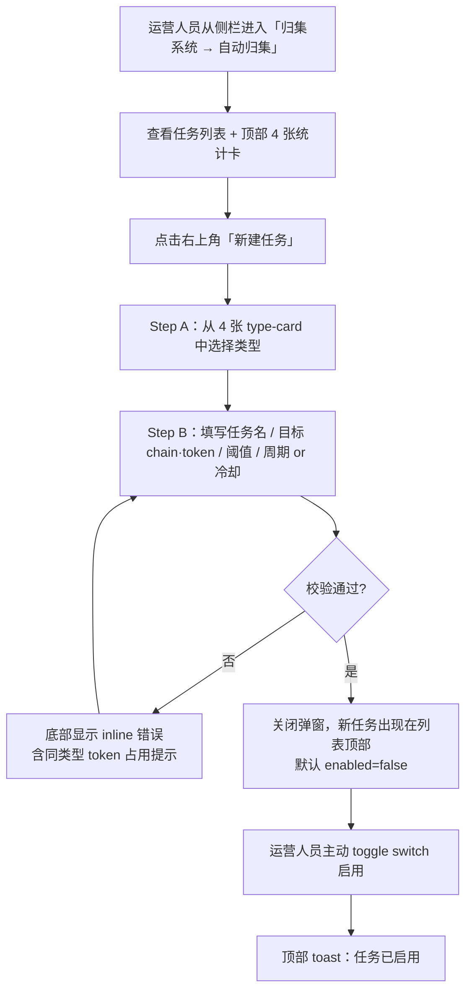

#### 3.3.2 J2：手动归集 BSC·USDT

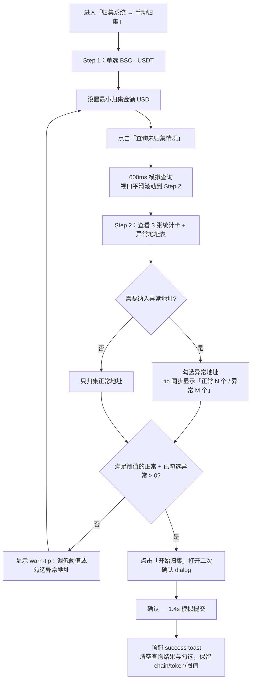

#### 3.3.3 J3：在「归集任务」中终止一个 running 任务

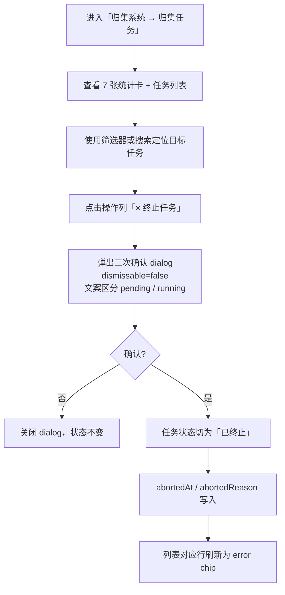

### 3.4 异常流程

| 异常场景 | 处理方式 |
|---------|---------|
| 同类型任务的目标 token 已被其它任务占用 | 表单提交时 inline 报错：「{chain}·{symbol}（已被「{name}」占用）」，列出全部冲突项 |
| 阈值字段为空或 ≤ 0 | inline 报错：「阈值必须大于 0（每个目标 token 都需填写）」，焦点保留在阈值字段 |
| 至少选 1 个目标 token 未满足 | inline 报错：「至少选择一个目标 chain → token」 |
| 手动归集查询结果为空（满足阈值的正常 + 已勾选异常合计 = 0） | 提交区域 tip 替换为 warn-tip：「当前阈值下没有可归集的地址。请调低最小归集金额 / 数量，或在上方异常地址表中勾选要包含的地址」；「开始归集」按钮 disabled |
| 手动归集 chain·token 切换 | 自动重置查询结果 / 异常勾选 / phase；保留刚才输入的阈值 |
| 「归集任务」终止已 completed / aborted 任务 | 操作列显示 `—`，不可点击 |
| 「归集任务」复制地址失败（剪贴板权限被禁） | toast：「复制失败，请手动选择地址」（error tone） |
| 创建任务弹窗中误关闭 | 普通编辑弹窗支持 mask click + ESC 关闭；删除 / 终止确认 dialog `dismissable=false`，强制点底部按钮 |

---

## 4. 功能需求

> **图例约定**：本章每个有 UI 的子模块的「5.X.2 UI 布局」嵌入了带元素编号的真实截图（红色圆形 marker，编号 1–N），与「5.X.3 交互规格」表格的「元素编号」列严格对齐。原型图采集与标注规范见附录 B。

### 4.1 自动归集（`/collection/auto`）

#### 4.1.1 功能描述

提供 4 种自动归集任务类型的可视化创建 / 编辑 / 启停 / 删除。任务一经启用即按其触发条件自动运行，归集完成后写入「归集任务」模块。任务默认 enabled=false，由运营人员主动 toggle 启用。

4 种类型的差异：

| 类型 | 触发方式 | 事件驱动 / 定时 | 关键参数 |
|------|---------|----------------|---------|
| 大额充值检测（large_deposit） | 收到 ≥ 触发金额的入金时立即归集该笔 | 事件驱动 | targets + triggerAmount + cooldown |
| 地址未活跃（inactive） | 周期内无出入金且余额 ≥ 阈值的地址，按 schedule 扫描 | 定时 | targets + inactiveWindow + minCollectAmount + schedule |
| 地址余额检测（balance_check） | 余额 ≥ 阈值的地址，按 schedule 扫描 | 定时 | targets + minCollectAmount + schedule |
| 提现不足触发（withdraw_short） | 提现热钱包不足且未归集金额 ≥ 提现金额时全地址异步归集 | 事件驱动 | targets + minCollectAmount + cooldown |

##### 事件驱动型任务的间隔规则（适用 large_deposit / withdraw_short）

事件驱动型任务（large_deposit、withdraw_short）的核心系统行为规则如下：作用域为「同一任务下的同一 `{chain, tokenId}` 维度」（不同 chain·token 互不影响）。

| 规则 | 触发条件 | 系统行为 | 业务理由 |
|------|---------|---------|---------|
| 处理中永远跳过 | 触发器命中（如收到 ≥ triggerAmount 的入金 / 检测到提现资金不足）时，本任务对该 `{chain, tokenId}` 的上一笔归集 status ∈ {pending, running}（即尚未 completed / aborted） | 本次触发被**永远跳过**（不入队、不计入 cooldown 起算），系统不重试该笔事件。运营人员从「归集任务」模块只能看到上一笔仍在 pending / running 中。 | 避免对同一资产并发发起多笔批量归集，防止链上 nonce 冲突 / 资金双花 / 状态重复入账。 |
| cooldown 期内跳过 | 触发器命中时，本任务对该 `{chain, tokenId}` 的上一笔归集 status = completed，且 `now - completedAt ≤ cooldown` | 本次触发被**跳过**（不入队，不重新计 cooldown 起算）；运营人员可以从下一次触发器命中、且 `now - completedAt > cooldown` 时再次进入流程。 | 防止短时间内连续触发归集风暴（极端情况下分钟级 cooldown + 高频事件），同时避免对热钱包高频写入。 |

> **补充说明**：
> - cooldown 起算锚点固定为「上一笔归集 `completedAt`」（不是 `pendingAt` 或触发时刻），确保 cooldown 是「成功之后的等待时长」。
> - 触发器命中但被两条规则跳过时，系统不写入 CollectionRecord（即「归集任务」列表不会出现 status=skipped 行）。
> - 这两条规则**仅适用于事件驱动型任务**；定时型任务（inactive、balance_check）不受 cooldown 约束，由 schedule 单独控制；上一次扫描未结束时若 schedule 又到点，按定时型任务的扫描合并策略处理。

#### 4.1.2 UI 布局

**F1 — 自动归集主页（任务列表，默认有数据）**

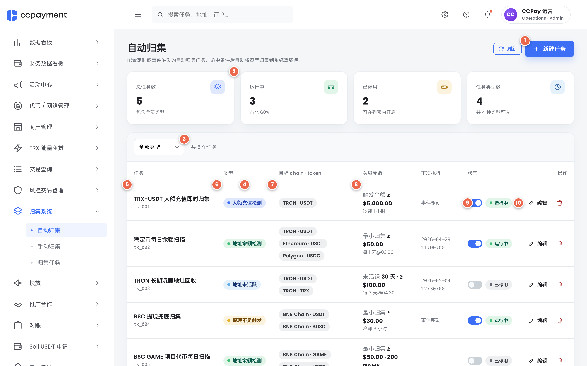

**F2 — 新建任务 Step A（类型选择）**

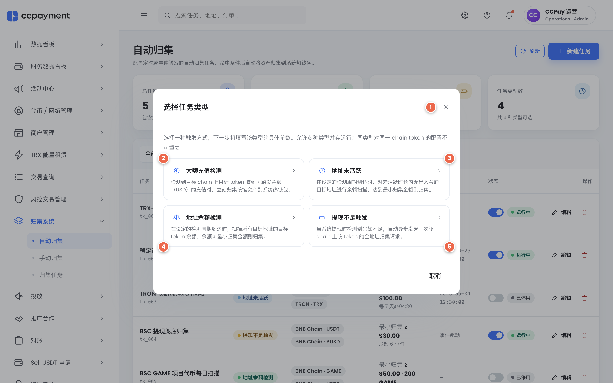

**F3 — 新建任务 Step B（大额充值检测，表单已填）**

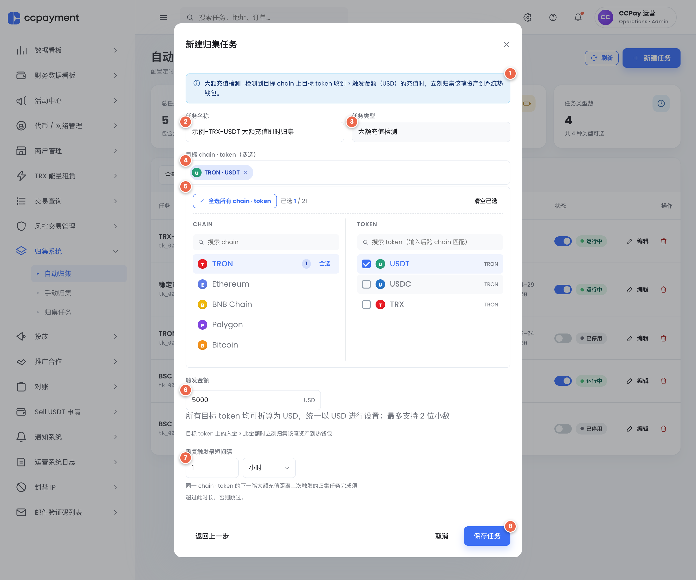

**F4 — 新建任务 Step B（地址余额检测 + schedule，表单已填）**

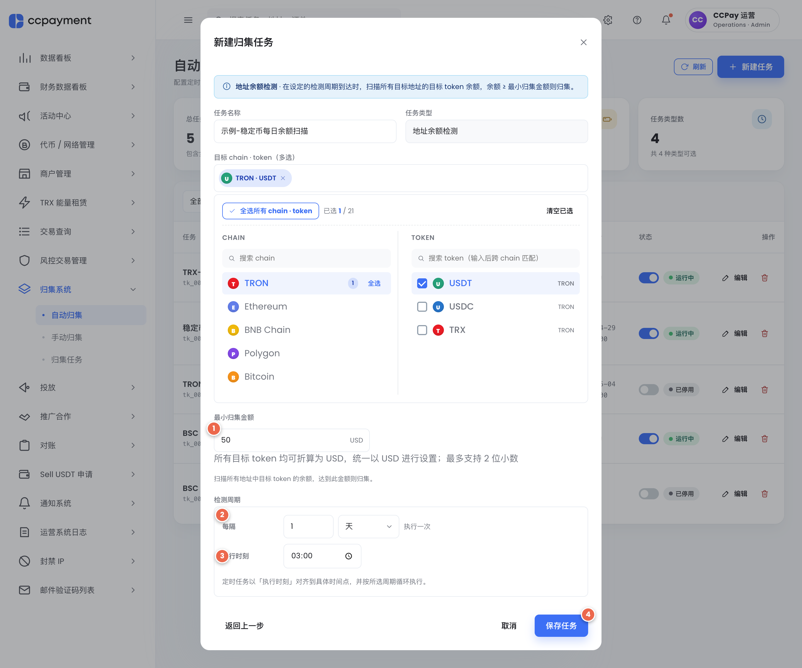

**F5 — 新建任务 Step B（提现不足触发 + cooldown + 间隔规则提示，表单已填）**

**F6 — AmountInput 混合模式（含 BSC:GAME + BSC:USDT）**

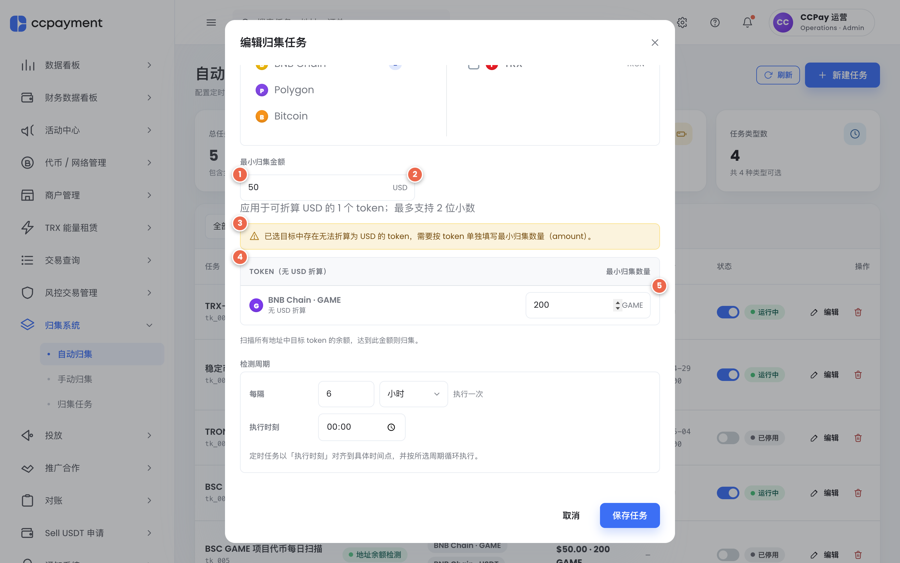

**F7 — 删除任务确认弹窗（dismissable=false）**

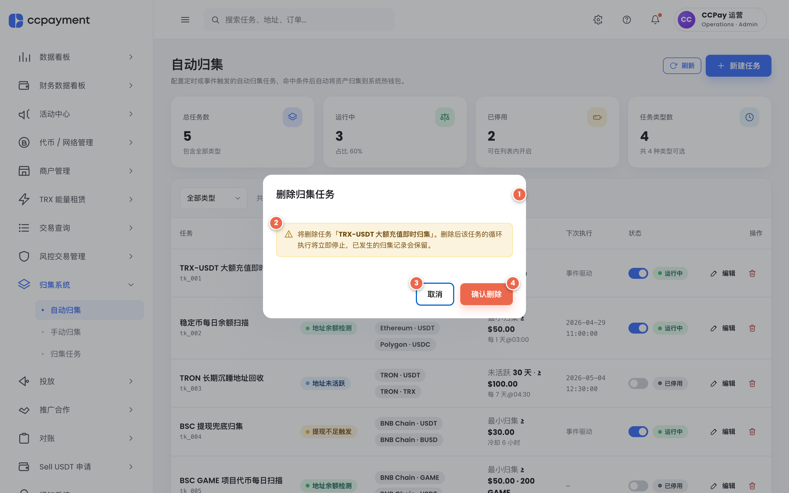

#### 4.1.3 交互规格

> 元素编号约定：`F{n}#k` 表示 F{n} 真实截图上的红色圆形标号 k。未在图中标注的元素（如行内编辑按钮、表头列等）用「（仅图外说明）」备注。

| 元素编号 | 元素 | 交互 | 结果 |
|---|---|---|---|
| F1#1 | 新建任务按钮（primary） | 点击 | 打开 F2 类型选择 dialog |
| F1#2 | 4 张统计卡（总任务数 / 运行中 / 已停用 / 任务类型数） | 实时联动 | 数值随列表变化实时刷新 |
| F1#3 | 类型筛选下拉 | 选择 | 列表按类型过滤；显示「共 N 个任务」 |
| F1#4 | 表格「任务」列（任务名 + ID） | 鼠标悬浮 | 行高亮（设计系统 hover 色） |
| F1#5 | 表格「类型」列（chip + dot） | — | 仅展示 |
| F1#6 | 表格「目标 chain·token」列 | — | 仅展示；超出 4 项折叠为「+N」 |
| F1#7 | 表格「关键参数」列 | — | 仅展示；2 行结构（参数主体 + muted 副行） |
| F1#8 | 表格「下次执行」列 | — | 事件驱动 → 「事件驱动」（muted）；定时 → mono 时间 |
| F1#9 | 状态 switch + chip | 点击 switch | 立即生效；顶部 toast：「任务「{name}」已启用 / 已停用」（success / info, 3s） |
| F1#10 | 操作列：编辑 / 删除按钮 | 点击编辑 | 打开 F3/F4/F5 对应的 Step B（跳过 Step A，类型只读，全部字段回填） |
| F1#10 | 操作列：删除按钮 | 点击删除 | 打开 F7 删除确认弹窗 |
| 页面标题区（仅图外说明） | 「自动归集」+ 子标题 | — | 仅展示 |
| 刷新按钮（仅图外说明） | 顶部刷新 | 点击 | 重新拉取任务列表 |
| F2#1 | dialog 关闭 X | 点击 | 关闭 dialog（Step A 阶段允许 mask click / ESC / X） |
| F2#2 | 大额充值检测 type-card | 点击 | 切换到 Step B（large_deposit），按类型预填默认值 |
| F2#3 | 地址未活跃 type-card | 点击 | 切换到 Step B（inactive），按类型预填默认值 |
| F2#4 | 地址余额检测 type-card | 点击 | 切换到 Step B（balance_check），按类型预填默认值 |
| F2#5 | 提现不足触发 type-card | 点击 | 切换到 Step B（withdraw_short），按类型预填默认值 |
| Step A 取消按钮（仅图外说明） | footer 取消 | 点击 | 关闭 dialog |
| F3#1 | 类型介绍 tip（icon + 描述） | — | 仅展示 |
| F3#2 | 任务名称输入 | 输入 | 校验非空；inline 错误「请填写任务名称」 |
| F3#3 | 任务类型只读字段 | — | 仅展示，禁止修改 |
| F3#4 | 已选 chip 行 | × chip / 全选所有 chain·token | 已选实时增删；点击 chip × 等价于 picker 内取消 |
| F3#5 | MultiTokenPicker（CHAIN + TOKEN 双列） | 多选 / 模糊搜索 / 全选某 chain / 全选所有 | 已选 chip 行同步更新；AmountInput 状态自动切换；至少 1 个；具体行为见 5.1.6 |
| F3#6 | 触发金额 AmountInput（USD 单值态） | 输入 | 见 5.1.4「AmountInput 状态切换」+ F6#1–F6#5 |
| F3#7 | 重复触发最短间隔（值 + 单位 选择 分/时/天） | 输入 + 选择 | 必须 > 0；inline 错误「重复触发最短间隔必须大于 0」 |
| F3#8 | 保存任务（primary） | 点击 | 校验（含同类型 token 唯一性）→ 通过则关闭 dialog 并写入列表，新任务默认 enabled=false |
| 返回上一步（仅图外说明） | footer 返回 | 点击 | 回到 Step A（仅创建模式可见；编辑模式无此按钮） |
| 取消（仅图外说明） | footer 取消 | 点击 | 关闭 dialog；丢弃 draft |
| F4#1 | 最小归集金额 AmountInput | 输入 | 见 5.1.4 / F6 |
| F4#2 | 检测周期 ScheduleEditor — 每 N + 单位 | 输入 + 选择 | 由「每 N + 单位（分/时/天）」组成 |
| F4#3 | 检测周期 ScheduleEditor — 执行时刻 | 输入 | HH:mm 时间；从 unit=天起出现 |
| F4#4 | 保存任务（primary） | 点击 | 同 F3#8 |
| F5#1 | warn-tip 间隔规则 | — | 仅展示，强调处理中永远跳过 / cooldown 期内跳过 |
| F5#2 | 最小归集金额 AmountInput | 输入 | 见 5.1.4 / F6 |
| F5#3 | 重复触发最短间隔 | 输入 + 选择 | 同 F3#7 |
| F5#4 | 保存任务（primary） | 点击 | 同 F3#8 |
| F6#1 | USD 输入框 | 输入 | step=0.01；min=0.01；最多 2 位小数；应用于全部可折算 token |
| F6#2 | USD 单位后缀 | — | 仅展示 |
| F6#3 | 模式提示（warn 区块） | — | 仅展示；自动写入「混合模式：需为不可折算 token 单独填写数量」 |
| F6#4 | 「TOKEN（无 USD 折算）」section 标题 | — | 仅展示 |
| F6#5 | per-token 数量输入行（CoinBadge + token 名 + 数量 input + 单位） | 输入 | step=1e-8；最多 8 位小数；当 targets 增删时该表自动同步行 |
| F7#1 | 删除 dialog 标题「删除归集任务」 | — | 仅展示 |
| F7#2 | warn-tip：将删除任务「{name}」… | — | 仅展示 |
| F7#3 | 取消（ghost） | 点击 | 关闭 dialog，任务保留 |
| F7#4 | 确认删除（danger） | 点击 | 从列表移除该任务；不发 toast（沿用现有原型行为） |

#### 4.1.4 状态说明

| 状态 | 触发条件 | UI 表现 |
|------|---------|--------|
| 任务列表 — 默认（有数据） | 至少存在 1 个任务 | F1：表格按 createdAt DESC 排序；空时展示空态（圆形 icon + 标题 + 一句解释） |
| 任务行 — 已停用 | enabled=false | switch 关闭 + 「已停用」neutral chip（dot + 文字） |
| 任务行 — 运行中 | enabled=true | switch 开启 + 「运行中」success chip |
| 任务行 — 下次执行 | 事件驱动型 | mono 字「事件驱动」（muted） |
| 任务行 — 下次执行 | 定时型 | mono 字「YYYY-MM-DD HH:mm:ss」 |
| AmountInput — 全部可折算 | 所选 targets 全部 convertibleToUsd=true | 单 USD 输入；step=0.01；suffix「USD」 |
| AmountInput — 全部不可折算 | 所选 targets 全部 convertibleToUsd=false | 仅 per-token 数量输入表 |
| AmountInput — 混合 | targets 包含至少 1 个 convertibleToUsd=false | 同时显示 USD 输入 + per-token 表（仅列不可折算 token） |
| 表单错误 | 校验失败 | 弹窗内底部 inline form-error：红色背景 + IconAlert + 多条原因换行；保存按钮可再次点击 |
| 同类型 token 占用 | 校验时检测到同 type 已占用同 tokenId | inline form-error：「同一任务类型下，目标 token 不可重复配置：{chain}·{symbol}（已被「{name}」占用）；…」 |
| Step A → Step B 切换 | 点击 type-card | dialog 不关闭，内部内容切换；Step A 隐藏，Step B 渲染默认值 |
| Step B → Step A 返回 | 点击「返回上一步」 | draft 丢弃，回到 Step A |
| 删除确认 | 点击删除按钮 | 打开 F7 dialog，dismissable=false |
| 处理中（processing） | 事件驱动型任务对该 {chain, tokenId} 的上一笔归集 status ∈ {pending, running}，触发器再次命中 | 系统行为：触发被**永远跳过**；UI 行为：列表「下次执行」列保持 mono「事件驱动」（muted）；该笔归集仍可从「归集任务」模块按 status=pending/running 的常规规则查看与终止 |
| 冷却中（cooldown） | 事件驱动型任务对该 {chain, tokenId} 的上一笔归集 status=completed，且 `now - completedAt ≤ cooldown`，触发器再次命中 | 系统行为：触发被**跳过**；UI 行为：列表「下次执行」列保持 mono「事件驱动」（muted），不展示 cooldown 倒计时（保持现有原型行为）；下一次触发器命中且 `now - completedAt > cooldown` 时方才正常进入 pending |

#### 4.1.5 数据展示

| 字段 | 业务含义 | 显示格式 |
|------|---------|---------|
| 任务名 | 运营人员定义的任务名称 | 14px / 600 字重；下方接 task id（11px mono muted） |
| 类型 | 4 种之一 | chip + dot（颜色由类型决定：primary / info / success / warning） |
| 目标 chain·token | 已选 tokenId 列表 | neutral chip 行；最多 4 项，超出折叠为「+N」 |
| 关键参数 — 大额触发 | triggerAmount + cooldown | 第 1 行「触发金额 ≥ {amountSpec}」；第 2 行 muted「冷却 N 单位」 |
| 关键参数 — 余额扫描 | minCollectAmount + schedule | 第 1 行「最小归集 ≥ {amountSpec}」；第 2 行 muted「每 N {单位} @ HH:mm」 |
| 关键参数 — 未活跃 | inactiveWindow + minCollectAmount + schedule | 第 1 行「未活跃 N {天/周/月} · ≥ {amountSpec}」；第 2 行 muted「每 N {单位} @ HH:mm」 |
| 关键参数 — 提现不足 | minCollectAmount + cooldown | 第 1 行「最小归集 ≥ {amountSpec}」；第 2 行 muted「冷却 N 单位」 |
| 下次执行 | nextRunAt 或类型 | 事件驱动 → 「事件驱动」（muted）；定时 → mono 时间 |
| AmountSpec | usd + amounts | 「≥ $50.00 · 200 GAME」（多 token 用 ` · ` 拼接）；不可折算 token 显示 token 数量 + symbol |

> 数字格式化（USD / token 数量 / 千位分隔 / 去尾零等）统一规范见 7.6「数字格式化规范」。

#### 4.1.6 MultiTokenPicker 行为细化

| 元素 / 行为 | 触发位置 | 交互结果 |
|------------|---------|---------|
| 「全选所有 chain·token」按钮 | picker 顶部 toolbar 右侧 | 一次点击勾选当前 picker 内所有 chain 下所有 token；再次点击全部取消；按钮文案在 select-all / clear-all 之间切换 |
| 「全选某 chain」按钮 | 每个 chain group 标题右侧（链名行尾） | 一次点击勾选该 chain 下所有 token；该 chain 已全选时点击切为全部取消；不影响其他 chain |
| chain 模糊搜索 | picker 顶部搜索框 | 匹配规则：子串匹配，不区分大小写；同时作用于 chain.name（如 "BNB Smart Chain"）和 chain.id（如 "bsc"）；命中的 chain group 整体保留，未命中的 chain group 隐藏；搜索框清空时全部 chain 恢复展示 |
| token 跨 chain 模糊搜索 | 同上搜索框（与 chain 搜索共用） | 匹配规则：子串匹配，不区分大小写；同时作用于 token.symbol（如 "USDT"）和所属 chain.name；当输入命中某个 token symbol 时，自动展开该 token 所在的 chain group；多 chain 同时存在该 symbol 时，所有命中的 chain group 同时展开；token level 命中的优先级与 chain level 命中相同（取并集，不需互斥） |
| 已选 chip 行同步 | picker 外部已选 chip 行 | 任一勾选 / 取消勾选 / 全选 / 清空操作，已选 chip 行实时增删对应 chip；chip 顺序按 chain → token 字母序稳定排序；点击 chip 上的 × 等价于在 picker 内取消该 token |

---

### 4.2 手动归集（`/collection/manual`）

#### 4.2.1 功能描述

提供一次性手动触发的归集流程。运营人员选择 chain·token、设定阈值、查询所有充值地址的未归集分布；查询结果分为正常资产（默认归集）和异常资产（默认不归集，需勾选）；阈值变更时异常表实时过滤；提交时弹二次确认，确认后异步执行并在「归集任务」模块产出对应记录。

#### 4.2.2 UI 布局

**F8 — 手动归集 Step 1（默认，已选 TRX·USDT）**

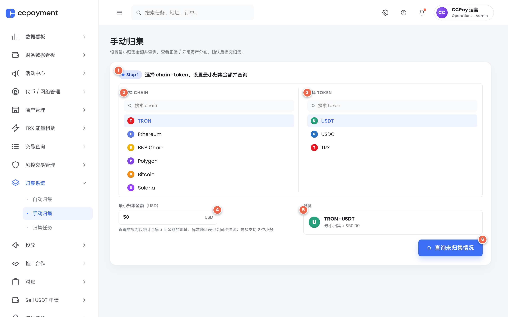

**F9 — 手动归集 Step 2（已查询，已勾选若干异常地址）**

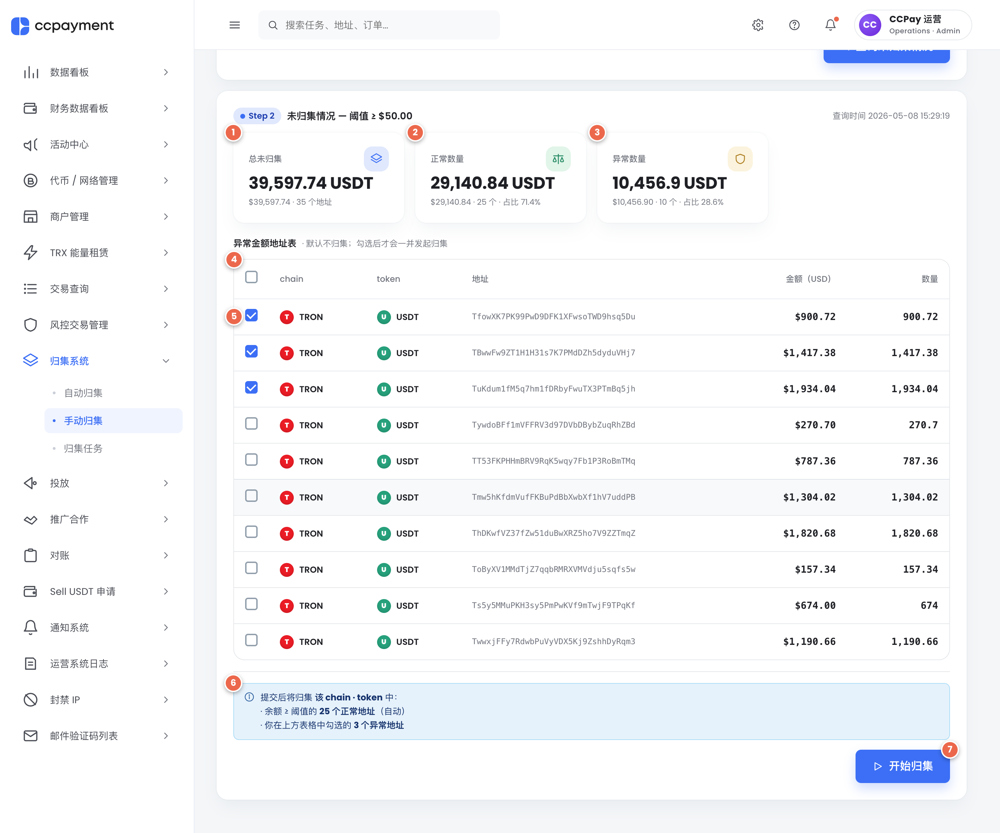

**手动归集二次确认 dialog（默认 dismissable=true）**

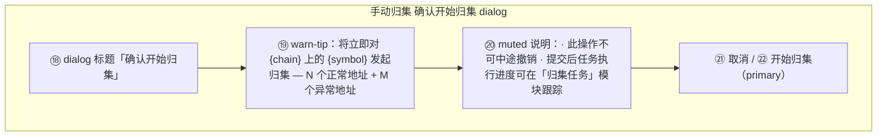

#### 4.2.3 交互规格

> 元素编号约定：`F{n}#k` 表示真实截图标号。手动归集二次确认 dialog 沿用 mermaid 内编号 ⑱⑲⑳㉑㉒（仅图外说明）。

| 元素编号 | 元素 | 交互 | 结果 |
|---|---|---|---|
| F8#1 | Step 1 chip + 标题「选择 chain·token、设置最小归集金额并查询」 | — | 仅展示 |
| F8#2 | 选择 CHAIN 列（chain 单选 picker，含搜索框 + 链列表） | 切换 chain | 自动重置查询结果 / 异常勾选 / phase；保留刚才输入的阈值 |
| F8#3 | 选择 TOKEN 列（当前 chain 下的 token 单选 picker，含搜索框 + token 列表） | 切换 token | 同上；可折算 / 不可折算切换驱动 ④ 形态 |
| F8#4 | 最小归集金额 / 数量输入 | 输入 | 可折算：USD，2 位小数，min=0；不可折算：token 数量，最多 8 位小数 |
| F8#5 | 预览卡片 | — | 仅展示；不可折算时右侧出现「无 USD 折算」warning chip |
| F8#6 | 查询未归集情况按钮（primary lg） | 点击 | 600ms 后写入查询结果；视口 `scrollIntoView({behavior:'smooth'})` 到 Step 2 |
| 页面标题区（仅图外说明） | 「手动归集」+ 子标题 | — | 子标题随 token 是否可折算切换「金额 / 数量」字 |
| F9#1 | Step 2 chip + 「总未归集」统计卡 | — | 仅展示；右侧 muted 显示查询时间戳 |
| F9#2 | 「正常数量」统计卡 | 实时联动 | 阈值或勾选改变时同步重新计算 |
| F9#3 | 「异常数量」统计卡 | 实时联动 | 同上；显示「占比 Y% / 已勾选 M 个」 |
| F9#4 | 异常金额地址表标题 + 提示「默认不归集；勾选后才会一并发起归集」 | — | 仅展示 |
| F9#5 | 全选 + 行 checkbox 列 | 点击全选 | 全选当前可见异常行（不影响阈值过滤掉的隐藏行） |
| F9#5 | 行 checkbox | 点击 | 切换该地址的勾选状态 |
| F9#6 | 提交说明 tip / warn-tip | — | 仅展示；正常 + 已勾选异常 > 0 显示提交说明（含「K 个因不满足阈值已自动忽略」次级说明）；= 0 时切为 warn-tip「调低阈值或勾选异常地址」 |
| F9#7 | 开始归集按钮（primary lg） | 点击 | 校验通过后打开二次确认 dialog；不满足条件时 disabled |
| 异常地址表（仅图外说明） | 列：chain / token / 地址 mono break-all / 金额 USD / 数量 | 阈值变更 | 实时过滤 |
| 隐藏提示（仅图外说明） | 「已根据当前阈值过滤掉 N 条不达标记录」 | — | 仅展示，hiddenAbnormalCount > 0 时出现 |
| ⑱ / ⑲ / ⑳（仅图外说明） | 二次确认 dialog：标题 / warn-tip / muted 说明 | — | 仅展示；该 dialog 默认 dismissable=true（mask click / ESC 可关闭） |
| ㉑（仅图外说明） | 取消（确认 dialog） | 点击 | 关闭 dialog，回到 Step 2 |
| ㉒（仅图外说明） | 开始归集（确认 dialog） | 点击 | 1.4s 模拟 → success toast → 仅清空查询结果与勾选，**保留** chain/token/阈值；用户可立刻 query 同 token 或换 token |

#### 4.2.4 状态说明

| 状态 | 触发条件 | UI 表现 |
|------|---------|--------|
| idle | 进入页面 | 仅 Step 1；Step 2 不渲染 |
| querying | 点击查询 | 按钮内显 spinner + 「查询中…」；按钮 disabled |
| queried | 查询完成 | Step 2 渲染；视口平滑滚动 |
| 阈值实时联动 | ④ 输入框变更 | 异常表行随之过滤；3 张卡数据重算；提交说明 / warn-tip 切换 |
| 异常勾选实时联动 | ⑪ / ⑫ checkbox | 异常数量卡的「占比」、「已勾选 M 个」实时更新 |
| 提交不可用 | 正常 + 已勾选异常 = 0 / 阈值非法 / 未查询 | 按钮 disabled，灰色 |
| submitting | 二次确认 ㉒ 已点击 | 按钮内显 spinner + 「正在提交…」 |
| post-submit | submitting 完成 | success toast；查询结果清空；Step 1 字段保留 |
| chain·token 切换 | ③ 切换 | 重置 query / phase / pickedAbnormal；Step 2 折叠 |
| 不可折算 token 模式 | token.convertibleToUsd=false | ④ 改为 token 数量 / 8 位小数；预览卡片显示「无 USD 折算」warning chip；3 张卡 USD 部分省略；异常表「金额（USD）」列显示 `-` |

#### 4.2.5 数据展示

| 字段 | 业务含义 | 显示格式 |
|------|---------|---------|
| 总未归集 / 正常 / 异常（统计卡 value） | 数量为主 | `{token-amount} {symbol}` 大字（千位分隔 + 去尾零） |
| 统计卡 hint | USD 为辅 | 「{usd} · N 个地址 / 占比 Y%」；不可折算时省略 USD 部分 |
| 异常表 — 地址 | 充值地址 | mono 字号 11.5；word-break: break-all；max-width 320 |
| 异常表 — 金额（USD） | 该地址未归集金额折算 USD | `$1,234.56`；不可折算时 `-`（dim） |
| 异常表 — 数量 | token 原生数量 | 千位分隔 + 去尾零；最多 8 位小数 |
| 提交说明 tip | 计数信息 | 「· N 个正常地址（自动） · 你勾选的 M 个异常地址（其中 K 个因不满足阈值被忽略）」 |
| 查询时间 | 查询发生时间 | mono YYYY-MM-DD HH:mm:ss |

> 数字格式化（USD / token 数量 / 千位分隔 / 去尾零等）统一规范见 7.6「数字格式化规范」。

---

### 4.3 归集任务（`/collection/jobs`）

#### 4.3.1 功能描述

汇总自动 + 手动归集产出的所有归集事件，1 条记录 = 1 个 `{chain, tokenId}` 一次性的批量归集（多 token 任务被拆为多条）。提供 7 张统计卡、4 个筛选器 + 任务名搜索、8 列三态排序、列表分页、归集地址明细弹窗、对 pending / running 任务的终止操作。

#### 4.3.2 UI 布局

**F10 — 归集任务主列表（默认）**

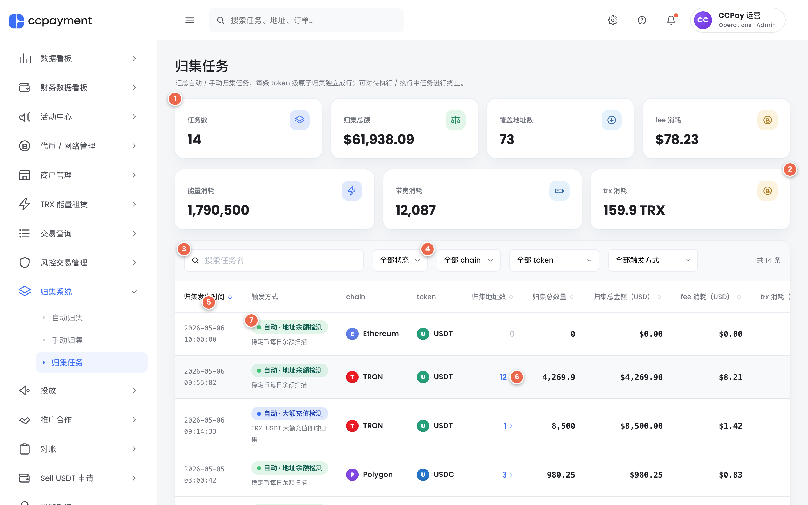

**F11 — 终止任务确认弹窗（dismissable=false）**

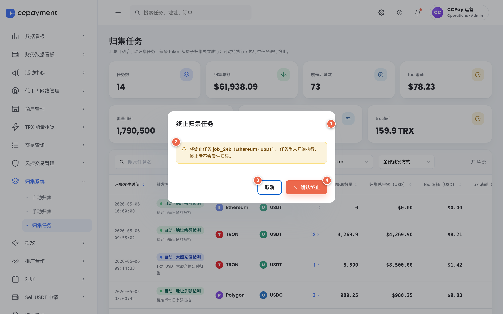

**F12 — 归集地址明细弹窗（已打开）**

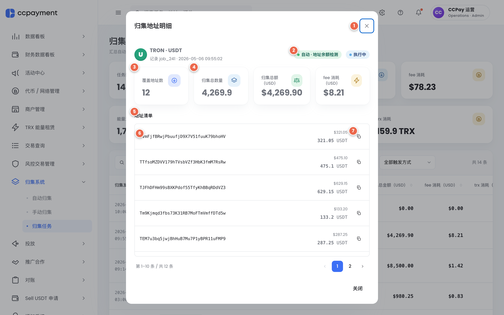

#### 4.3.3 交互规格

> 元素编号约定：`F{n}#k` 表示真实截图标号。pagination footer / 排序图标等子元素未单独标注，用「（仅图外说明）」备注。

| 元素编号 | 元素 | 交互 | 结果 |
|---|---|---|---|
| F10#1 | 第 1 行 4 张统计卡（任务数 / 归集总额 / 覆盖地址数 / fee 消耗） | 实时联动 | 数值随筛选 + 列表数据变化重新计算 |
| F10#2 | 第 2 行 3 张统计卡（能量 / 带宽 / trx 消耗） | 实时联动 | 同上；按当前筛选结果汇总 |
| F10#3 | 任务名搜索框 | 输入 | 实时按 triggerName 模糊匹配过滤 |
| F10#4 | 4 个筛选下拉（状态 / chain / token / 触发方式） | 选择 | 状态：全部 / 待执行 / 执行中 / 已完成 / 已终止；chain 切换时连带把 token 筛选重置为「全部 token」；token：chain ≠ all 时仅显示该 chain 下的 token；触发方式：全部 / 自动·4 种 / 手动归集 |
| F10#5 | 表头排序列（8 列） | 点击 | 三态切换：当前列 → desc → asc → 关闭（回到默认 occurredAt DESC）；非当前列 → 立即 desc |
| F10#6 | 触发方式 chip 列（5 种 chip 颜色） | — | 仅展示；下方 muted triggerName |
| F10#7 | 触发方式 row（chip + 任务名 muted） | — | 仅展示 |
| F10#8 | 「归集地址数」单元格（数字 + IconChevronRight） | 点击数字 | 数字 > 0 时打开 F12；数字 = 0（pending）时 dim 不可点；hover 浅蓝底 |
| 页面标题区（仅图外说明） | 「归集任务」+ 子标题 | — | 仅展示 |
| 「共 N 条」（仅图外说明） | 工具条右侧计数 | — | 仅展示 |
| 任务状态 chip（仅图外说明） | running 带 1.6s pulse 动画 | — | 见 5.3.4 |
| 操作列（仅图外说明） | pending / running → 「× 终止任务」按钮（ghost sm，error-dark）；其他状态 → `—` | 点击「× 终止任务」 | 打开 F11 确认 dialog，文案区分 pending / running |
| pagination footer（仅图外说明） | 高 64px，`--grey-100` 背景，border-top | — | 含「第 N–M / 共 X」/ 每页 10/20/50 选择 / 上下一页 / 数字按钮 |
| 每页条数选择（仅图外说明） | 10 / 20 / 50 | 选择 | 切换后回到第 1 页 |
| F11#1 | 终止 dialog 标题「终止归集任务」 | — | 仅展示 |
| F11#2 | 终止 warn-tip：将终止任务 {id}（{chain}·{symbol}）+ pending / running 差异文案 | — | 仅展示；文案根据 confirmAbort.status 切换 |
| F11#3 | 取消（终止 dialog，ghost） | 点击 | 关闭 dialog，状态不变 |
| F11#4 | 确认终止（danger） | 点击 | 写入 abortedAt（now）+ abortedReason（自动文案，见 5.3.4）；状态 → aborted；列表对应行刷新 |
| F12#1 | 详情弹窗关闭 X | 点击 | 关闭弹窗 |
| F12#2 | 触发方式 chip + 任务状态 chip（顶部 chip 行右侧） | — | 仅展示；同步反映该 record 的 trigger / status |
| F12#3 | 「覆盖地址数」统计卡 | — | 仅展示 |
| F12#4 | 「归集总数量 / 归集总额（USD）/ fee 消耗（USD）」3 张统计卡 | — | 仅展示；归集总数量不显示币种单位；不可折算 token 时归集总额显示 `—` |
| F12#5 | 「地址清单」section title | — | 仅展示 |
| F12#6 | 地址条目 — 地址 mono | — | 仅展示；word-break: break-all |
| F12#7 | 地址条目 — USD 小字 + 数量大字 + token 单位 + 复制按钮 | 点击复制 | 调用 clipboard API；成功 → success toast「地址已复制到剪贴板」（3s）；失败 → error toast「复制失败，请手动选择地址」 |
| 详情弹窗 compact pagination（仅图外说明） | addresses > 10 时出现 | 点击 | 仅控制弹窗内地址列表分页；与列表分页相互独立 |
| 详情弹窗 TRX chain 三 chip（仅图外说明） | 能量 / 带宽 / trx | — | 仅 chainId.isTrx=true 时出现 |
| 详情弹窗终止 error-tip（仅图外说明） | abortedReason + abortedAt | — | 仅 status=aborted 时显示 |
| 详情弹窗关闭按钮（仅图外说明） | footer 关闭 | 点击 | 关闭弹窗 |

#### 4.3.4 状态说明

| 状态 | 触发条件 | UI 表现 |
|------|---------|--------|
| pending（待执行） | 系统已排队但尚未开始 | neutral chip；操作列「× 终止任务」可用；地址数 = 0，dim 不可点 |
| running（执行中） | 链上交易已发起但未确认 | info chip + 文字带 pulse 动画；可终止；地址数已部分填充 |
| completed（已完成） | 全部地址成功归集 | success chip；操作列 `—`；详情可查全部地址 |
| aborted（已终止） | 运营人员手动终止 | error chip；详情顶部红色 error-tip 显示 abortedReason + abortedAt；操作列 `—`。abortedReason 自动文案规则：从 pending 终止 → 「运营人员手动终止；任务尚未开始执行，未发生归集」；从 running 终止 → 「运营人员手动终止；任务执行至第 N / M 个地址时中断」（其中 N = 终止时刻已完成的地址条目数，M = 该 record 总地址数）。文案由前端在写入时根据终止瞬间的 status / 已完成地址数自动生成，不可由运营人员自定义 |
| 排序激活 | 点击表头 | 当前列箭头变 primary，方向正确呈现；其他列箭头 muted |
| 筛选改变 | 任一筛选器变更或搜索框变化 | 自动回到第 1 页；统计卡随之刷新 |
| 详情弹窗 — 终止 | status = aborted | error-tip：「任务已终止」+ abortedAt + abortedReason |
| 详情弹窗 — TRX chain | chainId.isTrx=true | 底部 3 个 chip：能量 / 带宽 / trx；4 张统计卡保持不变 |
| 详情弹窗 — 不可折算 token | totalUsd 为空 | 「归集总额（USD）」卡片显示 `—`；地址条目不显示 USD 小字 |
| 详情弹窗 — addresses > 10 | 地址数大于一页 | 显示 compact pagination |

#### 4.3.5 数据展示

| 字段 | 业务含义 | 显示格式 |
|------|---------|---------|
| 归集发生时间 | occurredAt | mono YYYY-MM-DD HH:mm:ss |
| 触发方式 | trigger | 5 种 chip 颜色：primary（大额）/ info（未活跃）/ success（余额）/ warning（提现不足）/ neutral（手动）；下方 muted triggerName |
| chain | chain 名 + brand color | CoinBadge 22px + 名称 |
| token | token symbol + brand color | CoinBadge 22px + symbol |
| 归集地址数 | addresses.length | 数字 + IconChevronRight 12px；hover 浅蓝底 |
| 归集总数量 | totalAmount | 千位分隔 + 去尾零（最多 8 位）；右对齐 |
| 归集总金额（USD） | totalUsd | $1,234.56；不可折算 token 显示 `-`（dim） |
| fee 消耗（USD） | feeUsd | $0.01 |
| trx 消耗 / 能量 / 带宽 | TRX-only | 非 TRX 链显示 `-`（dim）；trx 保留 2 位；能量 / 带宽整数千位分隔 |
| 任务状态 | status | 4 种 chip + dot |
| 弹窗 — 归集总数量卡 | totalAmount | 数字（不显示币种单位） |
| 弹窗 — 地址条目数量 | per-address amount | 数字 + symbol（小字 muted） |
| 弹窗 — 地址条目 USD | per-address amountUsd | USD 小字（仅可折算时） |
| 顶部 7 张卡 — 任务数 | filtered.length | 整数 |
| 顶部 7 张卡 — 归集总额 | sum totalUsd | $1,234.56 |
| 顶部 7 张卡 — 能量 / 带宽 / trx | 仅 TRX 链 sum | 整数千位分隔；trx 保留 2 位 + ` TRX` 后缀 |
| abortedReason | 终止原因（自动文案） | pending 终止 → 「运营人员手动终止；任务尚未开始执行，未发生归集」；running 终止 → 「运营人员手动终止；任务执行至第 N / M 个地址时中断」（详见 5.3.4） |

> 数字格式化（USD / token 数量 / TRX 消耗 / 能量带宽千位分隔等）统一规范见 7.6「数字格式化规范」。

---

## 5. 数据概念

> **注意**：本章只描述业务实体与关系，不规定字段类型 / 表结构 / 索引 / API 路径。

### 5.1 业务实体

| 实体 | 说明 | 关键属性（业务级） |
|------|------|------------------|
| Chain | 区块链网络 | chain ID、显示名、品牌色、是否 TRX 系（决定能量 / 带宽 / TRX 消耗统计） |
| Token | 链上代币 | 复合 ID（chain:symbol）、symbol、所属 chain、品牌色、是否可折算 USD |
| Address | 充值地址 | 地址字符串、所属 chain、是否被风控冻结 |
| AutoTask | 自动归集任务 | 任务名、任务类型（4 种之一）、目标 token 列表、阈值（AmountSpec）、enabled、创建时间、上次运行时间、下次运行时间，以及类型专属属性（cooldown / schedule / inactiveWindow） |
| AmountSpec | 阈值统一表达 | 共享 USD 值（应用于全部可折算 token） + per-token 数量字典（应用于全部不可折算 token） |
| CollectionRecord | 单条归集记录 | 触发时间、触发方式（5 种）、关联任务名、目标 chain·token、参与地址明细、归集总数量、归集总额（USD，可空）、fee（USD）、TRX 链能量/带宽/trx 消耗（可空）、状态（4 种）、终止时间、终止原因 |
| AddressEntry | 单条归集记录里的地址条目 | 地址、金额（token 数量）、金额 USD（可空）、是否风控异常 |

### 5.2 实体关系

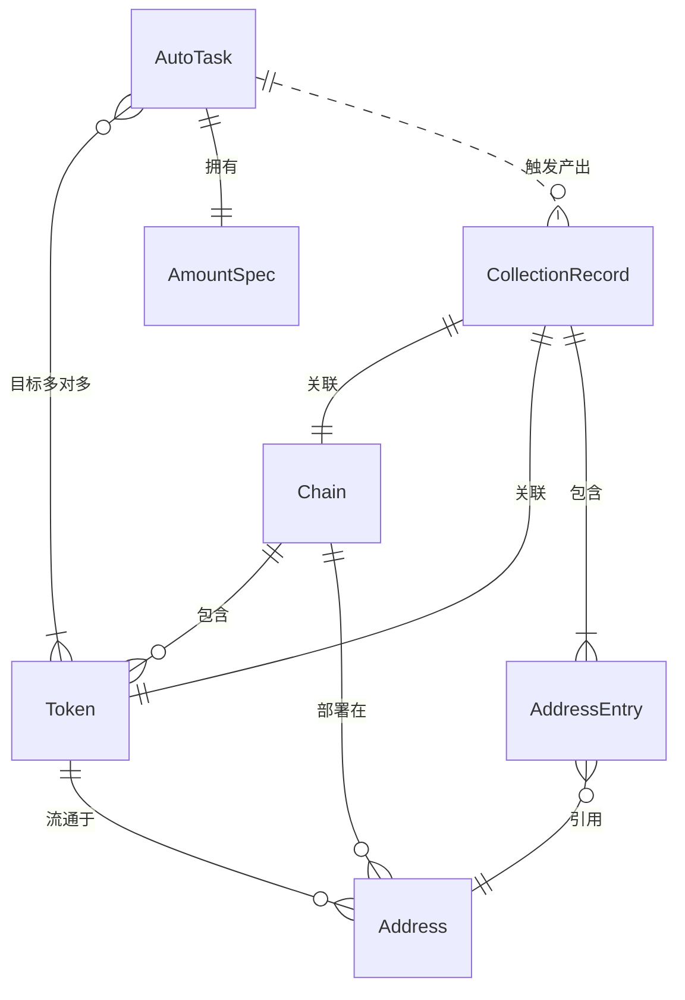

> 关键业务规则：
> - 1 条 CollectionRecord = 1 个 `{chain, tokenId}` 的一次性批量归集；多 token 的 AutoTask 触发时拆为多条 record。
> - 同一 `(AutoTask.type, tokenId)` 在所有 enabled / disabled AutoTask 中**全局唯一**（保存校验）。
> - AmountSpec 的有效性依赖 targets：`usd > 0`（含可折算）+ `amounts[每个不可折算 target] > 0`。
> - 手动归集不持久化为 AutoTask，但提交后产出 CollectionRecord（trigger=`manual`）。

---

## 6. 非功能需求

### 6.1 可访问性要求

- **键盘**：Tab / Shift+Tab 在 Modal 内循环；ESC 关闭普通 Modal（destructive confirm 除外）；表格行可通过键盘选中（hover 状态）。
- **焦点管理**：Modal 关闭后焦点还原到触发元素；body 滚动锁定。
- **空状态文案**：圆形 icon + 标题 + 一句解释（无感叹号），voice 中性。
- **错误信息**：表单内 inline form-error（红色 + IconAlert），不使用浏览器原生 `alert()`。
- **可点击单元格视觉提示**：链色 / IconChevronRight / hover 高亮，避免「看似不可点实际可点」歧义。

### 6.2 数字格式化规范

> 本节集中定义所有页面通用的数字格式化规则，第 5 章各 5.X.5 数据展示表保留简短说明并 cross-reference 此节。

| 数据类别 | 显示格式 | 示例 | 备注 |
|---------|---------|-----|------|
| USD 金额（阈值 / 总额 / 单地址金额） | `$` 前缀 + 千位分隔 + 固定 2 位小数（不去尾零） | `$1,234.56`、`$0.01`、`$50.00` | 不可折算 token 对应字段显示 `-`（dim）；详情弹窗中可显示 `—`。最小输入步长 step=0.01；min=0.01 |
| token 原生数量（阈值 / 单地址数量 / 归集总数量） | 千位分隔 + 去尾零 + 最多 8 位小数 | `1,234.5`（不显示 `1,234.50000000`）、`0.00000001`、`200` | 输入步长 step=1e-8；不显示 token 单位时按业务字段决定（详情弹窗归集总数量卡刻意不显示币种单位） |
| TRX 消耗（trx） | 千位分隔 + 固定 2 位小数 + ` TRX` 后缀（统计卡）/ 列表内仅数字 | `12.34 TRX`（卡片）/ `12.34`（表列） | 仅 TRX chain 有效；非 TRX 链显示 `-`（dim） |
| 能量消耗（energy） / 带宽消耗（bandwidth） | 千位分隔 + 整数（无小数） | `345,678` | 仅 TRX chain 有效；非 TRX 链显示 `-`（dim） |
| fee 消耗 | 同 USD 金额规则 | `$0.01` | BTC 链等无法精确折算时按第 12 章 Q2 处理（待澄清） |
| 占比 / 比例 | 整数百分比 + `%` 后缀 | `占比 60%` | 不显示小数点；**四舍五入（half-up）保留至整数百分比** |
| 计数（地址数 / 任务数 / 共 N 条） | 整数 + 千位分隔（≥ 1000 时） | `1,234`、`5` | 不带单位；上下文文案包含「个 / 条 / 张」字 |

> 通用规则：
> - 千位分隔符固定使用英文逗号 `,`（不使用空格或下划线）；
> - 小数点固定使用英文句点 `.`；
> - 「去尾零」对 token 数量适用，对 USD 金额不适用（USD 始终保持 2 位小数以保持视觉对齐）；
> - 所有数字字段在表格中右对齐，并使用 mono 字体（沿用 design system v2 的 `--font-mono`）。

---

## 7. 风险与缓解

| # | 风险 | 影响 | 概率 | 缓解措施 |
|---|------|------|------|---------|
| R1 | 同类型重复目标 token 配置导致归集混乱（同一 chain·token 被两个 large_deposit 任务竞争触发） | 高 | 中 | 表单保存校验：跨已存在任务，同 type 的目标 tokenId 全局唯一；冲突时 inline 报错并指明冲突任务名（已实现） |
| R2 | 不可折算 token 阈值误配（运营人员把 token 数量当 USD 数填） | 高 | 中 | AmountInput 自动随 targets 切换三态；不可折算输入框 step=1e-8 + 后缀显示 token symbol；预览卡片显示「无 USD 折算」warning chip |
| R3 | 终止运行中（running）任务的链上状态一致性 — 部分地址已发起链上交易，无法回滚 | 高 | 中 | 终止确认 dialog 文案明确说明「可能已对部分地址完成归集，这部分统计信息会保留」；后端在写 abortedAt 后停止排队但不发送链上撤销|
| R4 | 风控冻结状态在归集排队 → 执行之间发生变化（地址被新增冻结 / 解冻），导致归集结果与运营人员的查询时刻不一致 | 高 | 中 | 「手动归集」二次确认 dialog 提示「此操作不可中途撤销」；提交时由后端再次校验风控状态 |
| R5 | cooldown 配置过短引发归集风暴（极端情况下分钟级冷却 + 高频提现失败 → 频繁触发） | 中 | 低 | UI 不限制下限（最小允许 1 分钟），产品会提供初始建议设置值 |
| R6 | BTC 链等无法精确折算 fee USD 时的展示一致性 | 中 | 中 | 详情弹窗 fee 列允许显示 `—` |
| R7 | 删除任务后留存的 CollectionRecord 与已删除的 AutoTask 解关联，导致 triggerName 显示「未知任务」 | 中 | 低 | CollectionRecord 在写入时直接保存 triggerName 字符串（snapshot）；删除任务不影响历史记录 |

---

## 8. 产品验收标准

> 编号约定：AC = 功能验收（可被自动化测试）；UX = 用户体验验收（关注体感）。

### AC-001：自动归集 — 4 种类型创建（拆分为 5 个子项）

#### AC-001-1：创建 — large_deposit（大额充值检测）
- [ ] Step A 点击「大额充值检测」type-card 进入 Step B；类型只读字段显示「大额充值检测」
- [ ] 默认值预填：triggerAmount=USD 5000；cooldown=1 小时；targets=空（需运营人员选择）
- [ ] AmountInput 默认渲染为「全 USD」单值态（targets 未选时仍显示 USD 输入占位）
- [ ] Step B 保存（任务名 + targets + triggerAmount 通过校验）后任务出现在列表顶部
- [ ] 新任务默认 enabled=false，状态 chip「已停用」

#### AC-001-2：创建 — inactive（地址未活跃）
- [ ] 默认值预填：inactiveWindow=30 天；minCollectAmount=USD 50；schedule={every:1, unit:'day', anchorTime:'03:00'}
- [ ] Step B 渲染顺序：任务名 → 类型只读 → targets → minCollectAmount AmountInput → ScheduleEditor（含 inactiveWindow 字段）
- [ ] 保存后任务出现在列表顶部，enabled=false

#### AC-001-3：创建 — balance_check（地址余额检测）
- [ ] 默认值预填：minCollectAmount=USD 50；schedule={every:1, unit:'day', anchorTime:'03:00'}（与 inactive 同 schedule）
- [ ] Step B 不渲染 inactiveWindow 字段
- [ ] 保存后任务出现在列表顶部，enabled=false

#### AC-001-4：创建 — withdraw_short（提现不足触发）
- [ ] 默认值预填：minCollectAmount=USD 30；cooldown=6 小时
- [ ] Step B 含 F5#1 间隔规则 warn-tip（处理中永远跳过 / cooldown 期内跳过）
- [ ] 保存后任务出现在列表顶部，enabled=false

#### AC-001-5：Step A ↔ Step B 切换
- [ ] Step A → 选择任意 type-card → Step B 立即渲染，dialog 不关闭
- [ ] Step B 「返回上一步」按钮 → 回到 Step A，原 Step B 表单 draft 被丢弃
- [ ] Step A 「取消」按钮 → 关闭整个 dialog

### AC-002：自动归集 — 校验
- [ ] 任务名为空时点击保存，inline 报错「请填写任务名称」，弹窗不关闭
- [ ] targets 为空时报错「至少选择一个目标 chain → token」
- [ ] 大额触发金额 / 最小归集金额 ≤ 0 时报错「…必须大于 0…」
- [ ] cooldown.value ≤ 0 时报错「重复触发最短间隔必须大于 0」
- [ ] 同类型 + 同 tokenId 已被其它任务占用时，报错精确指出冲突任务名

### AC-003：自动归集 — 启停 / 编辑 / 删除
- [ ] 切换列表 switch，立即生效；顶部 toast「任务「{name}」已启用 / 已停用」（success / info, 3s）
- [ ] 编辑入口跳过 Step A，类型只读；目标 chain·token / 阈值 / cooldown / schedule / inactiveWindow 全部正确回填
- [ ] 删除按钮 → F7 弹窗 dismissable=false（mask click / ESC / X 不响应），「确认删除」后该任务从列表移除

### AC-004：自动归集 — AmountInput 三态
- [ ] 全部 targets 可折算 → 仅显示 USD 输入；step=0.01；min=0.01
- [ ] 全部 targets 不可折算（如仅 BSC:GAME） → 仅显示 per-token 数量表；step=1e-8；最多 8 位
- [ ] 混合（如 BSC:USDT + BSC:GAME） → 同时显示 USD 输入 + per-token 表（仅含 BSC:GAME 一行）
- [ ] targets 增删时 amounts 字典自动同步行（增 token 加行，删 token 移除）

### AC-005：手动归集 — 查询与阈值联动
- [ ] 选择 TRX·USDT、阈值 USD 50，点击「查询未归集情况」，600ms 后视口平滑滚动到 Step 2
- [ ] 阈值从 50 调到 200，异常地址表实时过滤；统计卡 3 项数值同步更新
- [ ] 隐藏提示文案「已根据当前阈值过滤掉 N 条不达标记录」在 hiddenAbnormalCount > 0 时出现
- [ ] 切换 chain·token，查询结果与异常勾选立即清空，但阈值字段保留

### AC-005-1：手动归集 — 异常勾选保留语义
- [ ] 在阈值 USD 50 下勾选 3 条异常地址（其中地址 A 金额 USD 60、地址 B 金额 USD 80、地址 C 金额 USD 120）→ 提交说明 tip 显示「· N 个正常地址（自动） · 你勾选的 3 个异常地址」
- [ ] 阈值上调到 USD 100 → 地址 A、B 因不满足阈值从异常表隐藏，地址 C 仍显示且仍为勾选态
- [ ] 提交说明 tip 切换为「· N 个正常地址（自动） · 你勾选的 1 个异常地址（其中 2 个因不满足阈值已自动忽略）」（K=2 子句仅在 K>0 时出现）
- [ ] `pickedAbnormal` 内部状态保留地址 A、B 的勾选记录（而非清空）
- [ ] 阈值再调回 USD 50 → 地址 A、B 重新出现在异常表中且仍为勾选态（无需运营人员重新勾选）；提交说明 tip 恢复为「3 个异常地址」无 K 子句

### AC-006：手动归集 — 提交
- [ ] 「正常 + 已勾选异常 = 0」时提交按钮 disabled，显示 warn-tip 而非提交说明 tip
- [ ] 点击「开始归集」打开二次确认 dialog；确认后 1.4s 显示 success toast「该次手动归集任务已提交」
- [ ] 提交后查询结果与勾选清空，chain/token/阈值字段保留

### AC-007：归集任务 — 列表筛选 / 排序 / 分页
- [ ] 4 个筛选器分别工作（status / chain / token / trigger）；任意筛选改变后回到第 1 页
- [ ] chain 切换时 token 筛选自动重置为「全部 token」
- [ ] 8 列三态排序：第一次 desc → 第二次 asc → 第三次关闭（回到默认 occurredAt DESC）
- [ ] 每页条数选择 10 / 20 / 50；切换后回到第 1 页
- [ ] pagination footer 高度 64px，背景 `--grey-100`

### AC-008：归集任务 — 终止
- [ ] pending / running 任务操作列显示「× 终止任务」按钮（ghost sm，error-dark）
- [ ] completed / aborted 任务操作列显示 `—`，不可点
- [ ] 点击终止 → F11 弹窗 dismissable=false，文案根据 status 切换（pending：尚未开始执行；running：可能已对部分地址完成归集，这部分统计信息会保留）
- [ ] 确认后状态切为 aborted，写入 abortedAt（当前时刻）和 abortedReason
- [ ] abortedReason 自动文案：从 pending 终止 → 字符串完全匹配「运营人员手动终止；任务尚未开始执行，未发生归集」
- [ ] abortedReason 自动文案：从 running 终止 → 字符串匹配「运营人员手动终止；任务执行至第 {N} / {M} 个地址时中断」（其中 {N}={已完成地址数}、{M}={总地址数}），N、M 为终止瞬间的实际计数

### AC-009：归集任务 — 明细弹窗
- [ ] 点击「归集地址数」单元格的数字 + IconChevronRight，打开 F12 弹窗
- [ ] 弹窗顶部 chip 行：触发方式 + 任务状态 chip 同步显示
- [ ] aborted 状态下弹窗顶部出现红色 error-tip，含 abortedReason + abortedAt
- [ ] 4 张统计卡正确显示：覆盖地址数 / 归集总数量（无单位）/ 归集总额（USD 或 `—`）/ fee 消耗
- [ ] 地址条目复制按钮点击后 success toast「地址已复制到剪贴板」（3s）；剪贴板被禁时 error toast
- [ ] 地址数 > 10 时弹窗内显示 compact pagination；其分页与外层列表分页相互独立

### AC-010：归集任务 — TRX 链
- [ ] TRX 链 record 在列表「trx 消耗 / 能量消耗 / 带宽消耗」3 列显示数值；非 TRX 链显示 `-`（dim）
- [ ] 顶部第 2 行 3 张统计卡（能量 / 带宽 / trx）按当前筛选结果汇总
- [ ] 详情弹窗 TRX chain 时底部 3 个 chip：能量 / 带宽 / trx

### AC-011：自动归集 — 事件驱动型任务的间隔规则（large_deposit / withdraw_short）
- [ ] **处理中永远跳过**：构造任务 T1（type=large_deposit, target=BSC·USDT, triggerAmount=USD 5000, cooldown=1 小时），上一笔归集对 BSC·USDT 的 record status=running（未 completed）；此时再次发生 ≥ USD 5000 的 BSC·USDT 入金事件 → 系统不入队新归集，「归集任务」列表只能看到原 running 那一笔，没有新增 record
- [ ] **cooldown 期内跳过**：T1 的上一笔归集 status=completed 且 completedAt 距今 30 分钟（cooldown=1 小时未到）；再次发生 ≥ USD 5000 的 BSC·USDT 入金事件 → 系统不入队新归集，「归集任务」列表无新增 record
- [ ] **cooldown 过期后正常触发**：T1 的上一笔归集 completedAt 距今 65 分钟（> 1 小时 cooldown）；再次发生 ≥ USD 5000 的 BSC·USDT 入金事件 → 系统正常入队新归集，「归集任务」列表新增一条 status=pending 的 record，且其 trigger=auto_large_deposit、triggerName=T1.name
- [ ] **作用域为 {chain, tokenId}**：T1 同时配置 BSC·USDT 与 ETH·USDT 两个 targets；BSC·USDT 处于 running，ETH·USDT 收到 ≥ USD 5000 的入金 → ETH·USDT 不受 BSC·USDT 处理中影响，正常入队新归集
- [ ] withdraw_short 类型同样适用以上 4 条规则（替换触发条件为「提现热钱包不足且未归集金额 ≥ 提现金额」）
- [ ] **跳过期间任务列表 UI 行为**：自动归集任务列表（F1）中正在 cooldown 或 processing 期间被跳过的事件驱动型任务，「下次执行」列保持显示「事件驱动」灰色 muted 文字（不出现倒计时 / 不变橙色），状态 chip 保持「运行中」绿色（不切到「冷却中」/「跳过」），即仅在底层日志记录跳过事件，UI 不感知
- [ ] **cooldown 边界 case**：当 `now - completedAt = cooldown`（即冷却时长恰好到达边界但未严格超过）时，**仍判定为冷却中、跳过本次触发**；只有严格 `now - completedAt > cooldown` 时才算冷却已过、允许触发。冷却判定使用严格大于（`>`），避免边界值的双重含义。

### UX-001：导航
- [ ] 默认进入 `/collection/auto`
- [ ] 侧栏「归集系统」一级 active 时，仅子级 active 项有 `rgba(60,111,245,0.08)` 背景 + primary 文字 + medium 字重，父级仅 primary 文字
- [ ] 视口 ≤ 1280px 时侧栏自动折叠为 72px icon-only

### UX-002：destructive confirm
- [ ] 删除任务 / 终止任务弹窗：mask 点击不关闭、ESC 不响应、close-x 不存在
- [ ] 焦点陷阱：Tab / Shift+Tab 在 modal 内循环

### UX-003：toast / snackbar
- [ ] 4 种 tone（success / info / warning / error）；右上角；最多多条堆叠
- [ ] 默认 5s 自动消失；显式 3s 类（如启停 / 复制成功）按指定时长
- [ ] 200ms enter 动画；不阻塞页面交互

### UX-004：可点击单元格视觉提示
- [ ] 「归集地址数」单元格：数字 + IconChevronRight 12px 后缀；hover 浅蓝底；dim 0 时无后缀且不可点

### UX-005：手动归集滚动
- [ ] 查询完成后视口自动 `scrollIntoView({ behavior: 'smooth' })` 到 Step 2，且 Step 2 顶部预留 16px scroll-margin

---
