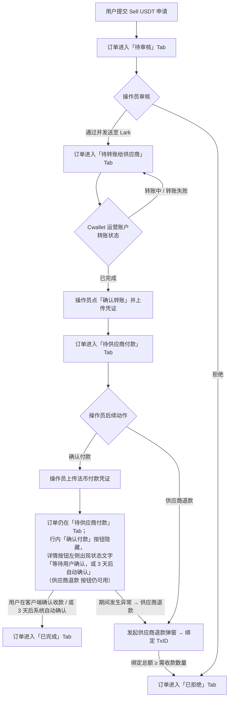

# PRD：Sell USDT 申请模块

> **文档版本**：1.1
> **状态**：草稿
> **作者**：PRD Writer Subagent（基于 `workflow/source-requirements.md` v1，含 §17.bis / §17.ter / §18 增量）
> **创建日期**：2026-05-21
> **最后更新**：2026-05-21

---

## 1. 文档信息

### 1.1 基本信息

| 属性 | 值 |
|------|----|
| PRD 编号 | PRD-SELL-USDT-001 |
| 所属产品 | CCPayment 运营后台 |
| 优先级 | P0 |
| 预计版本 | v1.1 |
| PRD 基线版本 | v1.1 |
| 最后同步日期 | 2026-05-21 |

### 1.2 修订历史

| 版本 | 日期 | 变更内容 | 作者 |
|------|------|----------|------|
| 1.0 | 2026-05-21 | 首版：覆盖 Sell USDT 申请模块、服务费设置、商户详情收费配置、热钱包资产管理（入账视图）四个相关页面的全部业务交互 | PRD Writer Subagent |
| 1.1 | 2026-05-21 | 新增「确认付款 后 等待用户确认」过渡态需求（FR-100a/b/c/d、AC-011a）+ 清理 round-2 遗留术语（§9.1 与 FR-107 / FR-120 / AC-012 中的 `word-break` / `disabled`） | PRD Writer Subagent |

### 1.3 术语表

| 术语 | 定义 |
|------|------|
| Sell USDT 申请 | 商户用户使用 USDT 兑换法币的业务申请单。运营后台的本模块用来跟踪与处理这类申请单。 |
| 运营操作员 | 运营后台的日常使用者，负责审核与处理申请单。下文简称「操作员」。 |
| Cwallet 运营账户 | CCPayment 平台用于中转 USDT 的「自己的」Cwallet 账户，所有用户 USDT 先流入此账户再分发。 |
| Cwallet 供应商账户 | CCPayment 平台与供应商共用的 Cwallet 账户，平台把 USDT 转入这里，供应商即可见到。 |
| 供应商 | 实际向用户支付法币的合作方。 |
| 市场汇率 | 同一时刻某 USDT/法币对的市场参考汇率。 |
| 供应商汇率加点 | 平台从市场汇率中让利给供应商的百分比（全局参数，可在「服务费设置」中维护）。 |
| 平台服务费率 | 平台从用户卖出 USDT 中抽取的百分比（全局参数）。 |
| Record ID | 一笔 Sell USDT 申请单的业务流水号（在「已完成」列表中显示为 Order ID）。 |
| TxID | 链上一笔转账记录的唯一标识。 |
| Lark | 平台内部使用的通讯协作工具，操作员通过 Lark 通知供应商。 |
| 退款地址 | 在「待供应商付款」阶段，由系统为本订单分配的、用于把已转出的 USDT 退回平台的链上地址（按网络区分）。 |
| 供应商承兑量 / 供应商承兑 Amount / 供应商承兑数量 | 同一概念在不同语境下的显示形式，三者所指相同（公式中称「供应商承兑量」，列表列名与 Order Info 卡片字段称「供应商承兑 Amount」，计算模拟卡片称「供应商承兑数量」）。 |

---

## 2. 背景与目标

### 2.1 业务背景

CCPayment 平台为商户提供「用 USDT 兑换法币」的服务。一次完整链路是：

1. 用户在商户侧提交一笔 Sell USDT 申请（将自己账户中的 USDT 卖给平台、换取法币到指定收款银行账户）
2. 运营操作员在运营后台审核并放行该申请
3. 平台把 USDT 转给供应商
4. 供应商把法币转账到用户指定的收款银行账户
5. 操作员录入法币付款凭证，订单完成

整个链路涉及多步资金流转，需要一个集中、状态清晰、可审计的操作面板供运营操作员日常使用。当前运营后台缺少这样的面板。本期建设的 **Sell USDT 申请** 模块就是该面板。

### 2.2 产品目标

- 让操作员在一个页面内看到所有 Sell USDT 申请单当前所处的业务阶段
- 让操作员按阶段（Tab）批量处理订单，每个阶段只看到本阶段相关的操作按钮
- 让操作员能在订单的每个阶段录入相应凭证（Cwallet 转账凭证、法币付款凭证）
- 提供一键查看完整订单信息的「付款单信息」详情弹窗，覆盖订单的全部业务字段
- 提供供应商无法承兑时的退款工具（供应商退款弹窗）
- 提供服务费率与供应商汇率加点的全局配置入口，并支持现场试算
- 与商户管理、热钱包资产管理两个邻近模块的关键交叉点（商户法币提现费率、热钱包入账流水绑定）能够走通

### 2.3 成功指标

| 指标 | 目标值 | 数据来源 | 度量方式 |
|------|--------|----------|----------|
| 操作员日均处理订单数 | ≥ 现状提升 30% | 运营操作日志 | 操作员主操作按钮（通过 / 确认转账 / 确认付款）触发次数 |
| 单笔订单平均处理时长 | ≤ 5 分钟（从「待审核」到「已完成」之间操作员主动操作的累计耗时） | 各阶段时间戳差值 | 提交时间、过审时间、标记时间、完成时间之间的差值 |
| 服务费率配置准确性 | 100% 与「服务费设置」中保存值一致 | 服务费设置弹窗的保存记录 | 列表与详情弹窗中显示的费率与最近一次保存值比对 |
| 凭证录入合格率 | ≥ 99%（无空号、无金额错误、截图齐全） | 各凭证弹窗提交记录 | 抽查与回查 |
| 退款绑定准确率 | 100%（绑定后热钱包入账列表与本订单互相可追溯） | 热钱包入账列表「备注」字段 | 抽查与回查 |

### 2.4 业务现状

**当前流程**：本模块为运营后台中此前不存在的新模块，对应的 Sell USDT 申请此前缺乏专门工具支持，多数环节依赖人工沟通与外部表格记录。

**业务变更**：

| 变更项 | 变更前 | 变更后 |
|--------|--------|--------|
| Sell USDT 申请审核 | 通过 Lark 等外部工具协调，无统一面板 | 新增「Sell USDT 申请」模块，提供五个阶段 Tab 与详情弹窗 |
| 向供应商 Cwallet 转 USDT | 人工沟通 | 在「待转账给供应商」Tab 完成「确认转账」并上传凭证 |
| 法币付款凭证录入 | 人工沟通 | 在「待供应商付款」Tab 完成「确认付款」并上传凭证 |
| 服务费率 | 多方约定 | 统一维护在「服务费设置」弹窗 |
| 商户法币提现费率 | 多方约定 | 在商户详情「收费配置」Tab 的「法币提现」行编辑 |
| 供应商退款 | 无标准流程 | 在「待供应商付款」Tab 通过「供应商退款」弹窗发起，并绑定热钱包入账流水 |

**影响范围**：

| 影响对象 | 影响描述 |
|----------|----------|
| 运营操作员 | 主要使用者，新增日常操作工具 |
| 风控 / 财务复核员 | 通过详情弹窗查看订单全字段，验证流水链路与服务费 |
| 供应商 | 不直接使用本面板，但流程上需要配合（接收 Lark 通知、收取 USDT、付法币、必要时退款） |
| 商户管理模块 | 商户详情新增「收费配置」Tab，与本模块共享「供应商汇率加点」与平台费率的展示 |
| 热钱包资产管理模块 | 「供应商退款」流程需要在热钱包入账列表中绑定 TxID，并回写交易类型与备注 |

### 2.5 相关能力识别

| 已有能力 | 能力范围 | 与本需求匹配度 | 能力差距 | 建议方向 | 来源 |
|----------|---------|--------------|---------|---------|------|
| 运营后台左侧侧边栏导航 | 提供模块入口 | 完全匹配 | 需新增「Sell USDT 申请」条目，且需把「商户管理 / 代币、网络管理」分组在本期实现「商户列表」「热钱包资产管理」两个子项 | 复用现有侧边栏框架，按 §15 顺序新增条目 | source-requirements.md §15 |
| 「付款单信息」弹窗 | 订单详情展示 | 本期新建 | 弹窗结构、卡片组合按 Tab 不同（§5.2） | 新建统一组件，按 Tab 渲染卡片组合 | source-requirements.md §5 |
| 计算模拟卡片 | 服务费率 / 供应商汇率加点 / Sell Amount 的所见即所得试算 | 本期新建 | 「服务费设置」与「法币提现编辑」两个弹窗均使用同一组件 | 一份计算模拟组件 + 两处复用 | source-requirements.md §7.2、§12.1 |
| 热钱包入账流水 | 来自「热钱包资产管理」模块的入账记录列表 | 部分匹配 | 需要被「供应商退款」流程绑定，且绑定后回写「交易类型」「备注」两个字段 | 把入账列表能力对外开放给本模块的退款弹窗（按 §7.11.5 顺序校验） | source-requirements.md §10、§13 |

---

## 3. 范围

### 3.1 范围内

- Sell USDT 申请主页面（含 5 个 Tab：待审核 / 待转账给供应商 / 待供应商付款 / 已拒绝 / 已完成）
- 三个共享列表 Tab 的表格（待审核 / 待转账给供应商 / 待供应商付款）
- 已拒绝列表、已完成列表
- 付款单信息详情弹窗（按 Tab 渲染卡片组合）
- 通过并发送至 Lark 确认弹窗
- 服务费设置 弹窗（含计算模拟卡片）
- 确认转账 凭证弹窗（转账给供应商凭证）
- 确认付款 凭证弹窗（供应商法币履约凭证）
- 供应商退款 弹窗（含拒绝原因 / 退款地址 / TxID 绑定 / 收款进度 四块卡片）
- 商户管理 → 商户列表（直接进入商户详情）→ 商户详情页骨架与 8 个 sub-tab
- 商户详情 → 收费配置 Tab（8 行收费项展示，仅「法币提现」行实接编辑弹窗）
- 法币提现编辑 弹窗（含计算模拟卡片）
- 热钱包资产管理页（含 3 个 sub-tab、过滤区、表格、复制行为）
- 全局文案规范（cwallet → Cwallet；独立 id / Id → ID）

### 3.2 范围外

完整的不在范围列表见 §10。摘要：

- 侧边栏中所有标注「占位」的模块
- 商户详情中除「收费配置」外的 7 个 sub-tab
- 热钱包资产管理页右上角三个主色按钮（申请提现 / 出账申请记录 / 热钱包管理）
- 收费配置中除「法币提现」外的 7 行编辑/添加
- 已完成列表中「付款凭证号」的图片预览
- 已完成详情底部「复制信息」按钮的具体复制内容
- 订单状态自动流转的系统后台实现细节
- 「供应商退款完成后订单变更为已拒绝」的反向数据落点界面（仅描述运营行为）
- 「订单进入已完成后又被退款完成事件触发」的异常处理界面（仅声明业务规则，不实现 UI）

### 3.3 待确认事项

- [ ] 「复制信息」按钮的最终复制内容格式（本期占位）
- [ ] 「已完成」列表「付款凭证号」的图片预览交互（本期占位）
- [ ] 由系统后台如何下发「订单状态」「转账状态」字段（本期本界面按已约定的状态机展示）

---

## 4. 用户旅程

### 4.1 目标用户

| 角色 | 行为 |
|------|------|
| 运营操作员 (Operator) | 主操作者。日常活跃用户。覆盖审核、转账确认、付款凭证录入、供应商退款。 |
| 风控 / 财务复核员 | 偶尔查看「详情」弹窗，验证流水链路与服务费是否合理。 |
| QA / 测试人员 | 跟随每一条状态机走测试用例。 |

PRD 阅读人覆盖以上所有角色 + 研发；术语以业务表达为准。

### 4.2 前置条件

| 条件 | 说明 |
|------|------|
| 操作员已登录运营后台 | 进入侧边栏「Sell USDT 申请」之前应已通过登录 |
| 服务费设置已配置 | 平台服务费率与供应商汇率加点均有有效值（非空、0–100、最多 2 位小数） |
| 商户已开通法币提现 | 进入本模块的订单代表商户已具备发起 Sell USDT 申请的资格 |
| Cwallet 运营账户、Cwallet 供应商账户已就绪 | 顶部信息条所示的两个账户 ID 真实可用 |

### 4.3 主流程



> 关于「确认付款」之后的过渡态说明：操作员在「确认付款」弹窗提交成功后，订单**不会立即**进入「已完成」，而是先停留在「待供应商付款」Tab 进入一个**过渡态**，等待用户在客户端确认收款，或 3 天后由系统自动确认。详见 §7.10.1 FR-100a/b/c/d 与 §8 AC-011a。

### 4.4 异常流程

| 异常场景 | 处理方式 |
|----------|----------|
| Cwallet 运营账户转账失败 | 在「待转账给供应商」详情弹窗中显示红色「转账失败」并显示「重推」按钮（详见 FR-035） |
| 凭证缺一项（凭证号 / 金额 / 上传截图） | 弹窗底部「确认」按钮置灰，无法提交（详见 FR-086 / FR-098） |
| 操作员把同一 TxID 重复绑定到同一订单 | 校验后给出错误提示「该 TxID 已绑定」（详见 FR-131） |
| 操作员尝试绑定非 USDT 入账流水 | 错误提示「该 TxID 不是 USDT 交易，无法绑定」（详见 FR-128） |
| 已完成订单后又收到退款完成事件 | 系统后台把订单改为「已取消」并附原因「系统异常，请重试」；本期本界面不实现该异常处理 UI |
| 操作员在「待转账给供应商」中 Cwallet 转账状态非「已完成」时点击行 | 仅显示「详情」按钮，「确认转账」按钮不显示，避免误操作 |

---

## 5. 范围地图：本期建设的页面与弹窗

| 编号 | 名称 | 入口 | 用途 | 对应 FR 章节 |
|------|------|------|------|--------------|
| P-01 | Sell USDT 申请主页面 | 侧边栏 → Sell USDT 申请 | 列表 + 5 个 Tab + 顶部信息条 | §7.1 – §7.6 |
| M-01 | 服务费设置 弹窗 | 主页面顶部「服务费设置」按钮 | 维护供应商汇率加点 + 计算模拟 | §7.12 |
| M-02 | 付款单信息 弹窗 | 任一 Tab 行操作「详情」按钮 | 订单全字段查看 | §7.7 |
| M-03 | 通过并发送至 Lark 确认弹窗 | 待审核 Tab 行「通过并发送至 Lark」按钮 | 审核通过的二次确认 | §7.8 |
| M-04 | 转账给供应商凭证 弹窗（确认转账） | 待转账给供应商 Tab 行「确认转账」按钮 | 录入 Cwallet 转账凭证 | §7.9 |
| M-05 | 供应商法币履约凭证 弹窗（确认付款） | 待供应商付款 Tab 行「确认付款」按钮 | 录入法币付款凭证 | §7.10 |
| M-06 | 供应商退款 弹窗 | 待供应商付款 Tab 行「供应商退款」按钮 | 拒绝原因 + 退款地址 + TxID 绑定 + 收款进度 | §7.11 |
| P-02 | 商户详情页（默认激活「收费配置」） | 侧边栏 → 商户管理 → 商户列表 | 8 个 sub-tab；本期仅「收费配置」可用 | §7.13 |
| M-07 | 法币提现编辑 弹窗 | 商户详情 → 收费配置 → 法币提现 行「编辑」按钮 | 维护商户法币提现费率 | §7.14 |
| P-03 | 热钱包资产管理页（热钱包入账视图） | 侧边栏 → 代币/网络管理 → 热钱包资产管理 | 全部 USDT/TRX/ETH 入账与出账流水查看 | §7.15 |

---

## 6. 价格 / 费用计算（单一公式来源）

本节是所有列表、详情弹窗、计算模拟卡片必须沿用的同一组公式。任何字段调整都需同步更新列表、详情、计算模拟三处。

### 6.1 公式

```
平台服务费     = Sell Amount × 平台服务费率
供应商承兑量   = Sell Amount − 平台服务费
供应商承兑汇率 = 市场汇率 × (1 − 供应商汇率加点)
得到资产       = 供应商承兑量 × 供应商承兑汇率
外显服务费     = Sell Amount − 得到资产 ÷ 市场汇率
```

「外显服务费」是把法币结果按市场汇率反推回 USDT 后与 Sell Amount 的差额。这样可以把「供应商汇率加点」的隐性损失也体现进去。默认费率下：外显服务费 > 平台服务费。

### 6.2 默认费率验算样例（必须保留）

- Sell Amount = 50,000 USDT
- 平台服务费率 = 3%
- 供应商汇率加点 = 0.5%
- 市场汇率 = 1 USD/USDT（演示场景）

| 项 | 值 |
|----|----|
| 平台服务费 | 50,000 × 3% = **1,500 USDT** |
| 供应商承兑量 | 50,000 − 1,500 = **48,500 USDT** |
| 供应商承兑汇率 | 1 × (1 − 0.5%) = **0.995 USD/USDT** |
| 得到资产 | 48,500 × 0.995 = **48,257.5 USD** |
| 外显服务费 | 50,000 − 48,257.5 ÷ 1 = **1,742.5 USDT** |
| 外显服务费率 | 1,742.5 / 50,000 × 100% = **3.485%** |

「计算模拟」卡片在默认费率下显示的值必须与上表完全一致。

---

## 7. 功能需求

> 编号说明：FR-001 起，按主页面 → 弹窗 → 商户详情 → 热钱包顺序排列。每条 FR 都是一条可独立验收的交互。文案要求 100% 与本节给出的字面值一致；除 §6 公式外不允许出现技术术语。

### 7.1 Sell USDT 申请主页面（P-01）顶部区域


图中编号说明：
- ① 页面标题「Sell USDT 申请」
- ② Cwallet 运营账户 ID 信息条
- ③ Cwallet 供应商账户 ID 信息条
- ④ 供应商汇率加点信息条
- ⑤ 「服务费设置」按钮
- ⑥ 5 个 Tab（自左向右：待审核 / 待转账给供应商 / 待供应商付款 / 已拒绝 / 已完成）
- ⑦ 全局搜索（商户 ID 下拉 + 搜索框）
- ⑧ 列表表格（待审核 Tab 默认视图）
- ⑨ 分页条

| FR 编号 | 描述 |
|---------|------|
| FR-001 | 进入本模块时，页面标题区显示「Sell USDT 申请」。 |
| FR-002 | 标题右侧自左向右依次显示四个信息项：Cwallet 运营账户 ID（例 9527321）、Cwallet 供应商账户 ID（例 34575837）、供应商汇率加点（例 0.5%）、「服务费设置」按钮。 |
| FR-003 | 两个 Cwallet 账户 ID 字段使用等宽字体。 |
| FR-004 | 「供应商汇率加点」显示的百分比来自「服务费设置」弹窗最近一次保存值，未保存过则显示默认值 0.5%。 |
| FR-005 | 「服务费设置」按钮为主色蓝按钮，点击后打开服务费设置弹窗（M-01）。 |
| FR-006 | 标题下方按从左到右固定顺序显示 5 个 Tab：待审核 / 待转账给供应商 / 待供应商付款 / 已拒绝 / 已完成。进入页面时默认激活「待审核」Tab。 |
| FR-007 | 切换 Tab 后页面下方表格立即更新为对应 Tab 的列结构与数据。 |
| FR-008 | 页面右上角持续显示全局搜索（商户 ID 下拉 + 搜索框）。商户 ID 字段提供下拉切换搜索维度，本期下拉中仅「商户 ID」一项。 |
| FR-009 | 在搜索框中按回车，或下拉确认后，按当前 Tab 列表的数据按商户 ID 过滤。清空搜索框并确认后恢复完整列表。 |

### 7.2 「待审核」Tab 表格（共享表格 / 时间列 = 提交时间）


图中编号说明（与 7.1 同图，关注 ⑧ 表格区与 ⑨ 分页条）：
- ⑧-a 时间列（待审核 Tab 中列名「提交时间」）
- ⑧-b Record ID 列（截断省略号）
- ⑧-c 商户 ID 列（蓝色下划线，可点击）
- ⑧-d Sell Amount 列
- ⑧-e 外显服务费 列
- ⑧-f 平台服务费 列
- ⑧-g 供应商承兑 Amount 列
- ⑧-h 汇率 列
- ⑧-i 供应商汇率 列
- ⑧-j 得到资产 列
- ⑧-k 收款信息 列
- ⑧-l 操作 列（详情 / 通过并发送至 Lark / 拒绝）
- ⑨ 分页条「Rows per page: 100  1–N of N」

| FR 编号 | 描述 |
|---------|------|
| FR-010 | 「待审核」Tab 表格的第一列列名显示「提交时间」，单元格内容为用户提交订单的时间。 |
| FR-011 | 表格列顺序自左至右为：时间 / Record ID / 商户 ID / Sell Amount / 外显服务费 / 平台服务费 / 供应商承兑 Amount / 汇率 / 供应商汇率 / 得到资产 / 收款信息 / 操作。 |
| FR-012 | 「Record ID」单元格内容采用中间省略号显示（如 202507...370816）。 |
| FR-013 | 「商户 ID」单元格内容采用蓝色下划线样式呈现，可点击。点击后跳转到商户详情页（P-02，默认激活「收费配置」sub-tab）。 |
| FR-014 | 「Sell Amount」单元格显示用户要卖出的 USDT 数量，后缀单位「USDT」。 |
| FR-015 | 「外显服务费」「平台服务费」「供应商承兑 Amount」三列按 §6 公式即时计算并显示，单位 USDT。 |
| FR-016 | 「汇率」单元格显示市场汇率，例「1 USDT ≈ 0.90284 EUR」。 |
| FR-017 | 「供应商汇率」单元格按 §6 公式计算并显示。 |
| FR-018 | 「得到资产」单元格按 §6 公式计算并显示，单位为本订单法币币种（USD / EUR …）。 |
| FR-019 | 「收款信息」单元格示例：「BankName: TrueMoney (Thai…)」。BankName 部分加粗深色，银行名称部分采用蓝色下划线样式可点击。 |
| FR-020 | 「操作」列按从左到右顺序显示三个按钮：详情、通过并发送至 Lark、拒绝。前两者为主色（蓝），「拒绝」为红色危险按钮。 |
| FR-021 | 点击「详情」打开付款单信息弹窗（M-02），卡片组合为：Order Info → Recipient Info。 |
| FR-022 | 点击「通过并发送至 Lark」打开「通过并发送至 Lark」确认弹窗（M-03）。 |
| FR-023 | 点击「拒绝」直接将该订单流转至「已拒绝」Tab（本期不提供二次确认 UI）。 |
| FR-024 | 行 hover 时背景色变为浅灰（#FAFBFD）。 |
| FR-025 | 表头高度 56px，表头背景浅灰（#F4F6F9），表头文字 13px 灰色。 |
| FR-026 | 表格内容字号 14px，单元格上下 padding 18px。 |
| FR-027 | 表格内容不换行；横向内容过多时整张表横向滚动。 |
| FR-028 | 分页条位于表格底部右对齐，文案「Rows per page: 100 ▾  1–N of N  ←  →」。本期分页条为静态展示，不支持翻页操作。 |

### 7.3 「待转账给供应商」Tab 表格（时间列 = 过审时间）


图中编号说明：
- ① Tab「待转账给供应商」激活态
- ② 时间列列名「过审时间」
- ③ Record ID 列
- ④ 商户 ID 列（蓝色下划线，可点击）
- ⑤–⑩ 其它列与共享表格一致（Sell Amount / 外显服务费 / 平台服务费 / 供应商承兑 Amount / 汇率 / 供应商汇率 / 得到资产）
- ⑪ 收款信息 列
- ⑫ 操作列（详情 / 确认转账）

| FR 编号 | 描述 |
|---------|------|
| FR-029 | 「待转账给供应商」Tab 表格第一列列名显示「过审时间」，单元格内容为操作员在「待审核」Tab 点了「通过并发送至 Lark」的时间。 |
| FR-030 | 表格其它列与「待审核」表格列结构完全一致（详见 FR-011 至 FR-019）。 |
| FR-031 | 「操作」列按从左到右顺序显示：详情、确认转账。本 Tab 不显示「拒绝」。 |
| FR-032 | 「确认转账」按钮仅当本行 Cwallet 运营账户转账状态 = 已完成 时显示。 |
| FR-033 | 当本行 Cwallet 运营账户转账状态 = 转账中 或 转账失败 时，「操作」列仅显示「详情」按钮。 |
| FR-034 | 点击「详情」打开付款单信息弹窗（M-02），卡片组合为：Order Info → Recipient Info → 已通过审核 → 向 Cwallet 运营账户转账。 |
| FR-035 | 在该详情弹窗的「向 Cwallet 运营账户转账」卡片右上角，仅当转账状态 = 转账中 或 转账失败 时显示「重推」按钮。 |
| FR-036 | 「向 Cwallet 运营账户转账」卡片中的「转账状态」按状态显色：转账中 = 橙色、转账失败 = 红色、已完成 = 绿色。 |
| FR-037 | 「向 Cwallet 运营账户转账」卡片中，当转账状态 ≠ 已完成 时，「转账时间」字段值为空。 |
| FR-038 | 点击行内「确认转账」打开转账给供应商凭证弹窗（M-04）。 |

### 7.4 「待供应商付款」Tab 表格（时间列 = 标记时间）


图中编号说明：
- ① Tab「待供应商付款」激活态
- ② 时间列列名「标记时间」
- ③ Record ID 列
- ④ 商户 ID 列（蓝色下划线，可点击）
- ⑤–⑩ 其它列与共享表格一致
- ⑪ 收款信息列
- ⑫ 操作列（详情 / 确认付款 / 供应商退款）

| FR 编号 | 描述 |
|---------|------|
| FR-039 | 「待供应商付款」Tab 表格第一列列名显示「标记时间」，含义为操作员通知供应商付款的标记时间（即已发送 Lark 消息时间）。 |
| FR-040 | 表格其它列与「待审核」表格列结构完全一致。 |
| FR-041 | 「操作」列按从左到右顺序显示三个按钮：详情、确认付款、供应商退款。「供应商退款」为红色危险按钮。 |
| FR-042 | 点击「详情」打开付款单信息弹窗（M-02），卡片组合为：Order Info → Recipient Info → 已通过审核 → 向 Cwallet 运营账户转账（状态锁定为「已完成」）→ 供应商 Cwallet 账户转账信息。 |
| FR-043 | 「供应商 Cwallet 账户转账信息」卡片字段为：转账记录 ID、凭证上传时间、上传人（不再包含 Cwallet 账户 ID、转账币种、转账数量）。 |
| FR-044 | 点击「确认付款」打开供应商法币履约凭证弹窗（M-05）。 |
| FR-045 | 点击「供应商退款」打开供应商退款弹窗（M-06）。 |
| FR-045a | 在本 Tab 内已经走完「确认付款」流程的行进入过渡态，行操作区不再显示「确认付款」按钮，并在「详情」按钮左侧显示状态文字「等待用户确认，或 3 天后自动确认」；详细行为定义见 §7.10.1（FR-100a 至 FR-100d）。过渡态外观参见 F-15（`workflow/figures/F15-paying-paid-pending.png`）。 |

### 7.5 「已拒绝」Tab 列表


图中编号说明：
- ① 已拒绝列表中的某条订单
- ② 弹窗标题「付款单信息」
- ③ Order Info 卡片
- ④ Recipient Info 卡片
- ⑤ 已拒绝 卡片（拒绝原因 / 拒绝时间 / 操作人）
- ⑥ 底部「复制信息」按钮

| FR 编号 | 描述 |
|---------|------|
| FR-046 | 「已拒绝」Tab 表格列结构自左至右为：拒绝时间 / Record ID / 商户 ID / 已返还代币 / 拒绝原因 / 拒绝人 / 操作。 |
| FR-047 | 「已返还代币」单元格示例：「120,000 USDT」。 |
| FR-048 | 「拒绝原因」单元格在文本过长时采用截断显示，鼠标悬停显示完整文本的 tooltip。 |
| FR-049 | 「操作」列仅显示「详情」按钮，点击后打开付款单信息弹窗（M-02），卡片组合为：Order Info → Recipient Info → 已拒绝。 |
| FR-050 | 「已拒绝」卡片字段为：拒绝原因、拒绝时间、操作人。 |

### 7.6 「已完成」Tab 列表


图中编号说明：
- ① 已完成列表中的某条订单
- ② 弹窗标题「付款单信息」
- ③ Order Info 卡片
- ④ Recipient Info 卡片
- ⑤ 已通过审核 卡片
- ⑥ 向 Cwallet 运营账户转账 卡片（已完成）
- ⑦ 供应商 Cwallet 账户转账信息 卡片
- ⑧ 供应商法币履约凭证 卡片（付款凭证 ID / 凭证上传时间 / 上传人）
- ⑨ 底部「复制信息」按钮

| FR 编号 | 描述 |
|---------|------|
| FR-051 | 「已完成」Tab 表格列结构自左至右为：完成时间 / Order ID / 商户 ID / 法币付款 / 付款银行 / 付款凭证号 / 上传人 / 操作。 |
| FR-052 | 「Order ID」单元格内容采用中间省略号显示。 |
| FR-053 | 「法币付款」单元格示例：「98,990.09 USD」。 |
| FR-054 | 「付款凭证号」单元格内容截断显示且伴随图片图标。本期点击图片图标的查看付款凭证图片为占位，不实现。 |
| FR-055 | 「上传人」为提交付款凭证的操作员，与「已完成」步骤同人。 |
| FR-056 | 「操作」列仅显示「详情」按钮，点击后打开付款单信息弹窗（M-02），卡片组合为：Order Info → Recipient Info → 已通过审核 → 向 Cwallet 运营账户转账（已完成）→ 供应商 Cwallet 账户转账信息 → 供应商法币履约凭证。 |
| FR-057 | 「供应商法币履约凭证」卡片字段为：付款凭证 ID、凭证上传时间、上传人。 |

### 7.7 付款单信息 弹窗（M-02，统一标题）


图中编号说明：
- ① 弹窗标题「付款单信息」
- ② 关闭按钮 X
- ③ Order Info 卡片（Create At / Record Id / Merchant ID / Sell Amount / 外显服务费 / 平台服务费 / 供应商承兑 Amount / Rate / 供应商汇率 / Get Asset）
- ④ Recipient Info 卡片（Bank Name / Account Holder / BIC/SWIFT / IBAN/Account Number / Bank Address / Recipient's Address）
- ⑤ 底部「复制信息」按钮


图中编号说明（同一弹窗滚动到底状态）：
- ① 已通过审核 卡片
- ② 向 Cwallet 运营账户转账 卡片
- ③ 供应商 Cwallet 账户转账信息 卡片
- ④ 底部「复制信息」按钮

| FR 编号 | 描述 |
|---------|------|
| FR-058 | 不论从哪个 Tab 触发，详情弹窗标题统一显示「付款单信息」。 |
| FR-059 | 弹窗宽度 560px，内容超出时弹窗内滚动。 |
| FR-060 | 卡片按顺序自上而下垂直堆叠。各 Tab 卡片组合按 §7.2 / 7.3 / 7.4 / 7.5 / 7.6 所述。 |
| FR-061 | Order Info 卡片字段顺序固定：Create At、Record Id、Merchant ID、Sell Amount、外显服务费、平台服务费、供应商承兑 Amount、Rate、供应商汇率、Get Asset。 |
| FR-062 | Recipient Info 卡片字段顺序固定：Bank Name、Account Holder、BIC/SWIFT、IBAN/Account Number、Bank Address、Recipient's Address。 |
| FR-063 | 「已通过审核」卡片字段：过审时间、操作人。 |
| FR-064 | 「向 Cwallet 运营账户转账」卡片字段：转账金额、转账 ID、转账时间、转账状态。 |
| FR-065 | 「供应商 Cwallet 账户转账信息」卡片字段：转账记录 ID、凭证上传时间、上传人。 |
| FR-066 | 「供应商法币履约凭证」卡片字段：付款凭证 ID、凭证上传时间、上传人。 |
| FR-067 | 「已拒绝」卡片字段：拒绝原因、拒绝时间、操作人。 |
| FR-068 | 弹窗底部居中显示「复制信息」主色按钮。本期点击不输出具体复制内容（占位）。 |
| FR-069 | 弹窗标题字号 18px / 字重 700；Section 标题字号 18px / 字重 700；字段标签字号 14px，标签灰色（#71757E）；字段值靠右对齐。标签宽度占 44%、值占 56%。 |
| FR-070 | Record Id、Txid 等长字符串允许在字符之间换行（针对超长字符串如 Txid / 银行账号 / IBAN，避免横向溢出）。 |

### 7.8 「通过并发送至 Lark」确认弹窗（M-03）


图中编号说明：
- ① 弹窗标题「付款单信息」
- ② Order Info 卡片（与详情弹窗一致）
- ③ Recipient Info 卡片（与详情弹窗一致）
- ④ 红色警告条
- ⑤ 「拒绝」按钮（红色危险）
- ⑥ 「确认通过审核并发送到 lark」按钮（主色蓝）

| FR 编号 | 描述 |
|---------|------|
| FR-071 | 弹窗标题显示「付款单信息」。 |
| FR-072 | 弹窗内复用 Order Info + Recipient Info 两个卡片，字段顺序与「待审核」详情弹窗一致。 |
| FR-073 | 卡片下方显示醒目红色警告条，背景色 rgba(236,104,76,0.08)、边框色 rgba(236,104,76,0.32)，左侧带 ⚠ 图标，文案：「请确认已经和供应商沟通好了此笔承兑订单信息，对方愿意接受承兑再通过，否则点拒绝」。 |
| FR-074 | 弹窗底部右对齐显示两个按钮：「拒绝」（红色危险）、「确认通过审核并发送到 lark」（主色蓝）。 |
| FR-075 | 点击「拒绝」关闭本弹窗，订单流转至「已拒绝」Tab。 |
| FR-076 | 点击「确认通过审核并发送到 lark」关闭本弹窗，订单流转至「待转账给供应商」Tab。 |

### 7.9 转账给供应商凭证 弹窗（M-04，确认转账）


图中编号说明：
- ① 弹窗标题「转账给供应商凭证」
- ② 副标题「请核对向供应商 Cwallet 账户的转账信息并填写转账凭证」
- ③ 信息卡片标题「供应商 Cwallet 账户转账信息」
- ④ 信息卡片字段（Cwallet 账户 ID / 转账币种 / 转账数量）
- ⑤ 上传区文案「上传转账凭证截图（最多 5 张，必传）」
- ⑥ 上传缩略图槽（80×80） + 末尾「+」虚线方框
- ⑦ 凭证号输入框（标签「转账记录 ID 号」）
- ⑧ 金额输入框（标签「转账数量」，后缀单位「USDT」）
- ⑨ 底部「确认」全宽主色按钮

| FR 编号 | 描述 |
|---------|------|
| FR-077 | 弹窗标题显示「转账给供应商凭证」。 |
| FR-078 | 弹窗副标题显示「请核对向供应商 Cwallet 账户的转账信息并填写转账凭证」。 |
| FR-079 | 信息卡片标题显示「供应商 Cwallet 账户转账信息」。 |
| FR-080 | 信息卡片字段顺序：Cwallet 账户 ID = 34575837、转账币种 = USDT、转账数量 = 本行的 Cwallet 数量。 |
| FR-081 | 上传区上方文案显示「上传转账凭证截图（最多 5 张，必传）」。 |
| FR-082 | 上传区为可横向滚动的缩略图槽（80×80），末尾显示「+」虚线方框；点击「+」追加一张占位截图；缩略图右上角小 X 可移除；最多 5 张。 |
| FR-083 | 凭证号输入框单行高 48px，标签「转账记录 ID 号」。 |
| FR-084 | 金额输入框单行高 48px，标签「转账数量」，仅允许数字，最多 2 位小数；后缀单位为「USDT」。 |
| FR-085 | 底部「确认」按钮为全宽 44px 高主色按钮。 |
| FR-086 | 「确认」按钮启用条件同时满足：凭证号 trim 后非空、金额 trim 后非空、至少上传 1 张截图。任一不满足则按钮置灰，灰色背景灰色文字。 |
| FR-087 | 每次重新打开弹窗（含同行重开或在不同行打开），上一次的输入与上传全部清空。 |
| FR-088 | 点击「确认」并通过校验后：关闭弹窗，订单流转至「待供应商付款」Tab，本订单在详情弹窗中开始展示「供应商 Cwallet 账户转账信息」卡片。 |

### 7.10 供应商法币履约凭证 弹窗（M-05，确认付款）


图中编号说明：
- ① 弹窗标题「供应商法币履约凭证」
- ② 副标题「联系供应商收集法币转账凭证信息并在此页面进行记录以完成本交易」
- ③ 信息卡片标题「收款信息」
- ④ 信息卡片字段（Bank Name / Account Holder / BIC/SWIFT / IBAN/Account Number / Bank Address / Recipient's Address）
- ⑤ 上传区文案「上传付款凭证截图（最多 5 张，必传）」
- ⑥ 上传缩略图槽 + 末尾「+」虚线方框
- ⑦ 凭证号输入框（标签「付款凭证号」）
- ⑧ 金额输入框（标签「付款金额」，后缀单位 = 当前行法币币种）
- ⑨ 黄色提示条「商家已冻结资产将在确认后在余额中扣除，划转给系统热钱包平对 Cwallet 运营账户的 USDT 支出以及记录平台服务费收入。」
- ⑩ 底部「确认」全宽主色按钮

| FR 编号 | 描述 |
|---------|------|
| FR-089 | 弹窗标题显示「供应商法币履约凭证」。 |
| FR-090 | 弹窗副标题显示「联系供应商收集法币转账凭证信息并在此页面进行记录以完成本交易」。 |
| FR-091 | 信息卡片标题显示「收款信息」。 |
| FR-092 | 信息卡片字段顺序：Bank Name、Account Holder、BIC/SWIFT、IBAN/Account Number、Bank Address、Recipient's Address。Account Holder 演示场景占位「Jasee」。 |
| FR-093 | 上传区上方文案显示「上传付款凭证截图（最多 5 张，必传）」。 |
| FR-094 | 上传区行为与 FR-082 一致（80×80 缩略图、可移除、最多 5 张、必传）。 |
| FR-095 | 凭证号输入框标签为「付款凭证号」。 |
| FR-096 | 金额输入框标签为「付款金额」，仅允许数字，最多 2 位小数；后缀单位为当前行法币币种（USD / EUR …）。 |
| FR-097 | 信息卡片下方显示警告条，文案：「商家已冻结资产将在确认后在余额中扣除，划转给系统热钱包平对 Cwallet 运营账户的 USDT 支出以及记录平台服务费收入。」 |
| FR-098 | 底部「确认」按钮启用条件与 FR-086 完全一致。 |
| FR-099 | 每次重新打开本弹窗时，上一次的输入与上传全部清空。 |
| FR-100 | 点击「确认」并通过校验后：关闭弹窗，订单**仍停留在「待供应商付款」Tab 进入「等待用户确认」过渡态**（详见 FR-100a 至 FR-100d）；**不**立即流转至「已完成」Tab。订单真正进入「已完成」由用户在客户端确认收款，或 3 天后由系统自动确认时触发。 |

#### 7.10.1 确认付款 后「等待用户确认」过渡态（v1.1 新增）


图中编号说明：
- ① 第 1 行 详情 按钮左侧多出一行状态文字「等待用户确认，或 3 天后自动确认」（小灰字）
- ② 第 1 行 详情 按钮（仍可点击，打开付款单信息弹窗）
- ③ 第 1 行 供应商退款 按钮（红色危险样式，仍可点击）
- ④ 第 2 行（参照对照）仍正常显示 详情 / 确认付款 / 供应商退款 三个按钮——表明同表内不同订单状态互相不影响

| FR 编号 | 描述 |
|---------|------|
| FR-100a | 操作员在「待供应商付款」行点「确认付款」并把供应商法币履约凭证弹窗的全部内容提交成功后，该行的「确认付款」按钮**立即隐藏**。同一行的「详情」与「供应商退款」按钮保持显示且可点击；订单**仍停留在「待供应商付款」Tab，不进入「已完成」**。 |
| FR-100b | 进入过渡态后，该行「详情」按钮左侧出现一行状态文字「等待用户确认，或 3 天后自动确认」（文案一字不差），样式为小灰字、不可点击、不允许换行。 |
| FR-100c | 在过渡态期间，该行「供应商退款」按钮**仍可点击**；如发生异常，操作员仍可走「供应商退款」流程（打开 M-06 弹窗）。 |
| FR-100d | 同一张表内不同行的过渡态互不影响：已提交「确认付款」的行显示状态文字且隐藏「确认付款」按钮；未提交「确认付款」的行保持「详情 / 确认付款 / 供应商退款」三按钮的原样展示。重新进入页面或重启会话后，已处于过渡态的行仍以过渡态展示（由订单的系统后台状态决定，本界面只是镜像）。 |

### 7.11 供应商退款 弹窗（M-06）


图中编号说明：
- ① 弹窗标题「供应商退款地址」
- ② 卡片一「拒绝原因」（5 个单选项 + 自由输入框）
- ③ 卡片二「退款地址」（网络切换 Pill + 二维码 + 地址胶囊 + 复制图标 + 说明文案）
- ④ 卡片三「热钱包入账流水绑定」（含右上角「打开热钱包入账列表」蓝色链接、TxID 输入框 + 提交按钮、绑定列表）
- ⑤ 卡片四「收款进度」（需收款数量 / 供应商已支付数量）

#### 7.11.1 弹窗基本属性

| FR 编号 | 描述 |
|---------|------|
| FR-101 | 弹窗标题显示「供应商退款地址」。 |
| FR-102 | 弹窗宽度 560px，可在弹窗内滚动。 |
| FR-103 | 四块卡片自上而下顺序固定：拒绝原因 → 退款地址 → 热钱包入账流水绑定 → 收款进度。 |

#### 7.11.2 拒绝原因卡片

| FR 编号 | 描述 |
|---------|------|
| FR-104 | 卡片标题显示「拒绝原因」。 |
| FR-105 | 提供 5 个单选项，顺序自上而下为：供应商无法继续承兑、收款信息有误、风控拦截、系统对账异常、其他。 |
| FR-106 | 「其他」单选项右侧（或下方）提供自由输入框，placeholder 文案「请输入其他原因」。 |
| FR-107 | 当选中前 4 项中的任一项时，自由输入框禁用、置灰底色、不可点击、不可输入；选中「其他」时启用自由输入框。 |

#### 7.11.3 退款地址卡片

| FR 编号 | 描述 |
|---------|------|
| FR-108 | 卡片标题显示「退款地址」。 |
| FR-109 | 网络切换 Pill 组共 7 个按从左到右顺序为：TRC20 (Tron)、ERC20 (Ethereum)、BEP20 (BSC)、Polygon、Solana、Arbitrum、Optimism。当前选中的网络高亮蓝。 |
| FR-110 | 网络下方左侧显示 144×144 二维码（白底有内边距，二维码内容 = 当前网络的退款地址）。 |
| FR-111 | 二维码右侧上方显示「<网络名> 退款地址」（字号 12px，灰色），下方一行显示灰底胶囊样式的完整地址 + 右侧复制图标按钮。 |
| FR-112 | 地址下方一行小灰说明文案：「请使用 <网络名> 网络发送 USDT 到上述地址，单笔/多笔到账金额满足需收款数量即视为退款完成。」 |
| FR-113 | 同一订单的同一网络始终对应同一退款地址（由订单 Record ID 与网络共同决定，重开弹窗保持不变）。 |
| FR-114 | 点击地址行的复制图标，把完整地址复制到剪贴板。 |

#### 7.11.4 热钱包入账流水绑定卡片

| FR 编号 | 描述 |
|---------|------|
| FR-115 | 卡片头左侧显示标题「热钱包入账流水绑定」。 |
| FR-116 | 卡片头右侧显示蓝色文字链接「打开热钱包入账列表」，点击在浏览器新 Tab 打开热钱包资产管理页（P-03）。 |
| FR-117 | 卡片顶部显示信息「已绑定 N 笔流水」，N 为本订单当前绑定列表的笔数。 |
| FR-118 | 输入行包含 TxID 输入框 + 「提交」按钮（主色）。 |
| FR-119 | TxID 输入框 placeholder 文案：「输入热钱包入账 TxID」。 |
| FR-120 | 绑定总额 ≥ 需收款数量时，卡片顶部出现黄色信息条，文案：「⚠ 已绑定金额已满足需收款数量，订单将流转至 已拒绝 状态。」；同时 TxID 输入框置灰、不可输入，「提交」按钮置灰、不可点击。 |
| FR-121 | 绑定列表中每条绑定显示一行：TxID（等宽字体）+ 右侧金额 + 「解绑」按钮。 |
| FR-122 | 绑定列表为空时显示空态文案「暂无绑定流水」。 |
| FR-123 | 「解绑」按钮始终可点（即使在已完成绑定状态下也可解绑）。解绑后总额可能跌破阈值，此时输入区重新启用，黄色信息条消失。 |
| FR-124 | 同一订单的供应商退款弹窗重开时，从热钱包入账列表按「备注 = 本订单 Record ID」筛选并重建绑定列表，确保跨次会话保留绑定状态。 |

#### 7.11.5 TxID 绑定校验顺序（强制）

| FR 编号 | 描述 |
|---------|------|
| FR-125 | 点击「提交」时按以下顺序校验 TxID（任一不通过即返回对应错误提示并停止）： |
| FR-126 | 校验①（找不到）：TxID 不在热钱包入账流水内 → 错误「未在热钱包入账流水中找到该 TxID」。 |
| FR-127 | 校验②（非入账）：TxID 对应记录为出账流水 → 错误「该 TxID 不是入账流水」。 |
| FR-128 | 校验③（非 USDT）：TxID 对应入账记录是 TRX/ETH 等非 USDT 入账 → 错误「该 TxID 不是 USDT 交易，无法绑定」。 |
| FR-129 | 校验④（已绑定到其他订单）：TxID 已被作为别的订单的供应商退款 → 错误「该 TxID 已绑定到其他订单」。 |
| FR-130 | 校验⑤（已被标记为其他类型）：TxID 在热钱包入账列表里已被标记为非「供应商退款」的类型（如「借入」）→ 错误「该 TxID 已被标记了，无法绑定」。 |
| FR-131 | 校验⑥（本订单已绑定）：本订单绑定列表已存在此 TxID → 错误「该 TxID 已绑定」。 |
| FR-132 | 通过全部校验后：在热钱包入账列表中把该流水的「交易类型」字段写入「供应商退款」、「备注」字段写入本订单 Record ID；本订单绑定列表追加一行 { TxID、该流水的真实金额 }；清空 TxID 输入框。 |

#### 7.11.6 TxID 容错查找

| FR 编号 | 描述 |
|---------|------|
| FR-133 | 操作员从热钱包入账列表抄写 TxID 时，看到的是截断显示形式（前 10 字符 + … + 后 8 字符）。绑定查找按以下三级容错执行： |
| FR-134 | 容错①：与某条记录精确字符串相等。 |
| FR-135 | 容错②：输入 ≥ 12 字符且匹配某条记录的前 10 字符前缀，且唯一匹配。 |
| FR-136 | 容错③：输入 ≥ 16 字符且前 8 字符与后 8 字符同时匹配某条记录，且唯一匹配。 |
| FR-137 | 任一容错命中即视为找到该完整流水。绑定列表入列时使用流水的完整 TxID（不是用户输入），以确保后续解绑能找回。 |

#### 7.11.7 解绑

| FR 编号 | 描述 |
|---------|------|
| FR-138 | 点击「解绑」时：把该流水在热钱包入账列表中的「交易类型」字段改回空（即恢复为「点击标记」），「备注」字段清空；本订单绑定列表移除此条。 |

#### 7.11.8 收款进度卡片

| FR 编号 | 描述 |
|---------|------|
| FR-139 | 卡片标题显示「收款进度」。 |
| FR-140 | 字段「需收款数量」= 本订单的 Cwallet 数量。 |
| FR-141 | 字段「供应商已支付数量」= 绑定列表中各条金额之和。当其 ≥「需收款数量」时该字段以成功绿样式呈现。 |

### 7.12 服务费设置 弹窗（M-01）


图中编号说明：
- ① 弹窗标题「服务费设置」
- ② 「供应商汇率加点」输入字段（必填，% 后缀，0–100，最多 2 位小数）
- ③ 「计算模拟」卡片头部（左侧蓝色短条 + 文字「计算模拟」 + 右侧「模拟平台服务费率」内嵌输入框）
- ④ 卡片正文「用户 sell 50,000 USDT to USD」
- ⑤ 第一组结果：外显服务费 / 平台服务费 / 供应商承兑数量 / 供应商承兑汇率
- ⑥ 第二组结果（蓝色加粗高亮）：外显服务费率 / 用户实际到手
- ⑦ 底部「保存」按钮

| FR 编号 | 描述 |
|---------|------|
| FR-142 | 弹窗标题显示「服务费设置」。 |
| FR-143 | 弹窗内显示「供应商汇率加点」字段（必填，% 后缀，范围 0–100，最多 2 位小数）。 |
| FR-144 | 「计算模拟」卡片位于「供应商汇率加点」字段下方。 |
| FR-145 | 卡片头部一行内：左侧显示蓝色短条 + 文字「计算模拟」；右侧显示「模拟平台服务费率」内嵌输入框（96×28，% 后缀，placeholder「选填」）。 |
| FR-146 | 「模拟平台服务费率」为本弹窗内的选填项，不会回写任何全局值。 |
| FR-147 | 卡片正文按以下顺序显示： 「用户 sell 50,000 USDT to USD」→ 虚线分隔 → 外显服务费 / 平台服务费 / 供应商承兑数量 / 供应商承兑汇率 → 虚线分隔 →（蓝色加粗高亮）外显服务费率 / 用户实际到手。 |
| FR-148 | 各结果值按 §6 公式即时计算。默认费率下（Sell Amount=50,000、平台费率=3%、加点=0.5%、市场汇率=1）显示的值必须与 §6.2 验算表完全一致。 |
| FR-149 | 「供应商汇率加点」校验：空 → 错误「请输入数值」；超出 0–100 → 错误「范围为 0–100」。 |
| FR-150 | 「模拟平台服务费率」校验：可空，空时按 0% 参与计算；非空时与「供应商汇率加点」共用 0–100、≤2 位小数规则。 |
| FR-151 | 「保存」按钮仅校验「供应商汇率加点」字段。点击「保存」并通过校验后，把新值回写到主页面顶部「供应商汇率加点」信息条，并关闭弹窗。 |

### 7.13 商户管理 → 商户列表 → 商户详情（P-02）


图中编号说明：
- ① 左侧返回按钮「←」（返回 Sell USDT 申请）
- ② 标题「商户详情」
- ③ 8 个 sub-tab（默认激活「收费配置」）
- ④ 收费配置表（8 行 4 列：服务项目 / 费率 / 操作 / 累计收费）
- ⑤ 「法币提现」行（操作列「编辑」蓝色文字链接）

| FR 编号 | 描述 |
|---------|------|
| FR-152 | 侧边栏「商户管理」分组下「商户列表」直接进入商户详情页（本期不实现商户列表中间页）。 |
| FR-153 | 商户详情页顶部从左到右依次显示：返回按钮「←」、标题「商户详情」。点击返回按钮回到 Sell USDT 申请主页面。 |
| FR-154 | 商户详情页提供 8 个 sub-tab，自左至右顺序为：商户信息、成员信息、收费配置（默认激活）、数据概览、接口配置、操作日志、API 请求记录、商家归集费。 |
| FR-155 | 除「收费配置」外的 7 个 sub-tab 内容区显示占位文案：「该 tab 内容未在此原型中实现。」 |
| FR-156 | 收费配置表为 8 行 4 列，列名自左至右：服务项目、费率、操作、累计收费。 |
| FR-157 | 收费配置表行内容按下表（顺序与文案保持一致）： |
| FR-158 | 行 1：服务项目「归集费」、费率「商户支付」、操作「编辑」、累计收费「--」。 |
| FR-159 | 行 2：服务项目「代币充值」、费率「0.5%」、操作「编辑」、累计收费「--」。 |
| FR-160 | 行 3：服务项目「代币充值临时费率」、费率「--」、操作「添加」、累计收费「--」。 |
| FR-161 | 行 4：服务项目「API 换币」、费率「0.5%」、操作「编辑」、累计收费「--」。 |
| FR-162 | 行 5：服务项目「自动换币」、费率「0.6%」、操作「编辑」、累计收费「--」。 |
| FR-163 | 行 6：服务项目「自动提现」、费率「0.5%」、操作「编辑」、累计收费「--」。 |
| FR-164 | 行 7：服务项目「法币提现」、费率显示为「<当前法币提现费率>% + 0 USDT」、操作「编辑」（打开法币提现编辑弹窗 M-07）、累计收费「--」。 |
| FR-165 | 行 8：服务项目「风险资产提现」、费率「8 倍」、操作「编辑」、累计收费「网络费」并附注释「风险资产提现费用=商家入金服务费+n 倍网络费」。 |
| FR-166 | 操作列「编辑 / 添加」均以蓝色文字链接样式呈现。本期 PRD 范围内仅「法币提现」行的「编辑」实际接入弹窗，其余行点击为占位（不弹窗、不报错）。 |

### 7.14 法币提现编辑 弹窗（M-07）

> 本弹窗共用 §7.12 中描述的「计算模拟」组件，平台费率取本表单当前输入值，供应商汇率加点取顶部全局值。

| FR 编号 | 描述 |
|---------|------|
| FR-167 | 弹窗标题显示「法币提现平台服务费」。 |
| FR-168 | 「法币提现」字段为 Material 风格描边输入框 + 浮动标签 + % 后缀；必填，范围 0–100，最多 2 位小数。 |
| FR-169 | 「谷歌验证码」字段：单行输入框，仅 6 位数字，placeholder 文案「谷歌验证码」；必填。 |
| FR-170 | 字段上方显示浅蓝胶囊条「当前供应商汇率加点：0.5%」+ ⓘ 图标，% 值实时读取顶部全局「供应商汇率加点」。 |
| FR-171 | 弹窗内复用「计算模拟」卡片组件（与 M-01 相同）；卡片中的「平台服务费率」取本表单当前输入值，「供应商汇率加点」取顶部全局值。 |
| FR-172 | 「提交」按钮为全宽主色按钮，启用条件：法币提现费率有效（非空且 0–100、≤2 位小数）且谷歌验证码 = 6 位数字。 |
| FR-173 | 点击「提交」并通过校验后，把法币提现费率回写到收费配置表第 7 行「费率」字段（显示为「<新值>% + 0 USDT」），关闭弹窗。 |

### 7.15 热钱包资产管理 页（P-03，热钱包入账视图）


图中编号说明：
- ① 页面标题「热钱包资产管理」
- ② 右上角三个主色按钮（申请提现 / 出账申请记录 / 热钱包管理 — 本期均为占位）
- ③ 三个 sub-tab（所有账目（默认）/ 热钱包出账 / 热钱包入账）
- ④ 过滤区（交易类型 / 代币 / 网络 / Txid / 主键 ID）
- ⑤ 「查询」按钮（主色）
- ⑥ 「展开统计图」蓝色文字链接（占位）
- ⑦ 表格列（账目类型 / 主键 ID / 交易类型 / 交易数量 / 网络 / Txid / 交易时间 / 备注）

| FR 编号 | 描述 |
|---------|------|
| FR-174 | 页面标题显示「热钱包资产管理」。 |
| FR-175 | 标题右侧从左到右显示三个主色按钮：「申请提现」「出账申请记录」「热钱包管理」。本期三个按钮均为占位，点击无效果。 |
| FR-176 | 标题下方显示 3 个 sub-tab：所有账目（默认）、热钱包出账、热钱包入账。 |
| FR-177 | 本期仅「热钱包入账」视图（含数据与所有交互）有效；「所有账目」「热钱包出账」可切换，均显示对同一表数据的入账过滤（或空态）。 |
| FR-178 | sub-tab 下方为过滤区，自左至右依次为：交易类型下拉（所有类型 / 借入 / 供应商退款 / 其他）、代币下拉（所有代币 / USDT / TRX / ETH）、网络下拉（所有网络 / TRON / Polygon / BSC / ERC20 / Arbitrum / Optimism / Solana）、Txid 搜索框（带搜索图标）、主键 ID 搜索框（带搜索图标）。 |
| FR-179 | 过滤区下方单独一行显示「查询」按钮（主色），点击后用当前所有过滤输入过滤表格。 |
| FR-180 | 页面右上角显示「展开统计图」蓝色文字链接，本期为占位，点击无效果。 |
| FR-181 | 表格列按从左到右顺序为：账目类型、主键 ID、交易类型、交易数量、网络、Txid、交易时间、备注。 |
| FR-182 | 「账目类型」单元格显示「入账」或「出账」。 |
| FR-183 | 「交易类型」单元格：未分类的行显示蓝色文字链接「点击标记」；已分类的行显示分类文字（如「供应商退款」「借入」「其他」）。 |
| FR-184 | 「交易数量」单元格内含代币色圆圈图标。 |
| FR-185 | 「网络」单元格内含网络色圆点。 |
| FR-186 | 「Txid」单元格采用等宽字体截断显示，右侧带复制图标。点击 TxID 文本或复制图标都把完整 TxID 复制到剪贴板；复制成功后图标变绿色 √，1.5 秒后恢复。 |
| FR-187 | 「备注」单元格：已被「供应商退款」绑定的行显示对应订单 Record ID；未分配的行显示「--」。 |
| FR-188 | 演示场景下，表格中至少应包含：3 条 TRX 借入入账（交易类型 = 借入）；12 条不同网络的未分类 USDT 入账（交易类型 = 空，显示「点击标记」），金额范围覆盖 12.6 USDT 至 50,000 USDT。 |
| FR-189 | 当操作员在 M-06 弹窗中成功绑定一条 USDT 入账后，该行交易类型变为「供应商退款」，备注变为该订单 Record ID（与 FR-132 一致）。 |

### 7.16 文案规范

| FR 编号 | 描述 |
|---------|------|
| FR-190 | 全项目所有面向用户的文案中，`cwallet`（小写 c）一律改写为 `Cwallet`。 |
| FR-191 | 全项目所有面向用户的标签、列名、字段名中独立出现的 `id` / `Id` 一律改写为 `ID`（示例：`Record Id` → `Record ID`、「转账记录id」→ 「转账记录 ID」）。 |
| FR-192 | 代码层级的 camelCase 标识符（如 cwalletId、recordId）不改写。 |

### 7.17 侧边栏

| FR 编号 | 描述 |
|---------|------|
| FR-193 | 侧边栏条目按从上到下顺序为：数据看板、财务数据看板、活动中心、代币/网络管理（可展开，默认展开）→ 热钱包资产管理 / 代币列表 / 网络管理 / 变更记录、商户管理（可展开，默认展开）→ 商户角色管理 / 商户列表 / 商户注册列表 / 账户列表 / 资产冻结/解冻、TRX 能量租赁、交易查询、风控交易管理、归集系统、投放、推广合作、对账、Sell USDT 申请、通知系统、运营系统日志、封禁 IP、邮件验证码列表。 |
| FR-194 | 本期实际可用的子项为：代币/网络管理 → 热钱包资产管理；商户管理 → 商户列表；Sell USDT 申请。其余条目（含其子项）均为占位。 |
| FR-195 | 点击占位子项时进入对应路由，页面显示文案「该模块未在此原型中实现。」 |

---

## 8. 验收标准

> 每条 AC 都可独立测试。AC 编号与 FR 不一定一一对应，覆盖核心交互即可。

### AC-001：进入主页面并切换 Tab

- [ ] 进入 Sell USDT 申请主页面后，默认激活「待审核」Tab
- [ ] 顶部信息条按顺序显示 Cwallet 运营账户 ID、Cwallet 供应商账户 ID、供应商汇率加点、「服务费设置」按钮
- [ ] 切换到「待转账给供应商」Tab，表格第一列列名显示「过审时间」
- [ ] 切换到「待供应商付款」Tab，表格第一列列名显示「标记时间」
- [ ] 切换到「已拒绝」Tab，表格列结构为：拒绝时间 / Record ID / 商户 ID / 已返还代币 / 拒绝原因 / 拒绝人 / 操作
- [ ] 切换到「已完成」Tab，表格列结构为：完成时间 / Order ID / 商户 ID / 法币付款 / 付款银行 / 付款凭证号 / 上传人 / 操作

### AC-002：表格行交互

- [ ] 在三个共享 Tab 中任意行 hover 时背景变为浅灰
- [ ] 「商户 ID」单元格内容显示为蓝色下划线，点击后跳转到商户详情页（默认激活「收费配置」sub-tab）
- [ ] 表格内容字号 14px、单元格上下 padding 18px、表头高度 56px、表头背景浅灰
- [ ] 表格内容不换行，横向超出时整张表横向滚动
- [ ] 分页条文案「Rows per page: 100 ▾  1–N of N  ←  →」位于表格底部右对齐

### AC-003：「待审核」Tab 行操作

- [ ] 行操作按钮顺序为：详情、通过并发送至 Lark、拒绝
- [ ] 点击「详情」打开「付款单信息」弹窗，含 Order Info、Recipient Info 两块卡片
- [ ] 点击「通过并发送至 Lark」打开同名确认弹窗，含红色警告条「请确认已经和供应商沟通好了此笔承兑订单信息，对方愿意接受承兑再通过，否则点拒绝」
- [ ] 在确认弹窗点击「确认通过审核并发送到 lark」后，本订单流转至「待转账给供应商」Tab
- [ ] 在确认弹窗点击「拒绝」后，本订单流转至「已拒绝」Tab

### AC-004：「待转账给供应商」Tab 行操作

- [ ] 行操作不显示「拒绝」按钮
- [ ] 行 Cwallet 运营账户转账状态 = 已完成 时，行操作显示「确认转账」按钮
- [ ] 行 Cwallet 运营账户转账状态 = 转账中 或 转账失败 时，行操作仅显示「详情」按钮
- [ ] 点击「详情」打开「付款单信息」弹窗，含 Order Info、Recipient Info、已通过审核、向 Cwallet 运营账户转账 四块卡片
- [ ] 「向 Cwallet 运营账户转账」卡片转账状态文字颜色：转账中 = 橙、转账失败 = 红、已完成 = 绿
- [ ] 「重推」按钮仅在转账状态 = 转账中 或 转账失败 时显示；已完成 状态下不显示
- [ ] 转账状态 = 转账中 或 转账失败 时，「转账时间」字段为空

### AC-005：「待供应商付款」Tab 行操作

- [ ] 行操作按钮顺序为：详情、确认付款、供应商退款
- [ ] 「供应商退款」按钮为红色危险样式
- [ ] 点击「详情」打开「付款单信息」弹窗，含 Order Info、Recipient Info、已通过审核、向 Cwallet 运营账户转账（已完成）、供应商 Cwallet 账户转账信息 五块卡片
- [ ] 「供应商 Cwallet 账户转账信息」卡片仅显示三个字段：转账记录 ID、凭证上传时间、上传人

### AC-006：「已拒绝」Tab 行操作

- [ ] 行操作仅显示「详情」按钮
- [ ] 「拒绝原因」单元格在文本过长时截断显示，悬停可见完整 tooltip
- [ ] 点击「详情」打开的弹窗含 Order Info、Recipient Info、已拒绝 三块卡片
- [ ] 「已拒绝」卡片字段为：拒绝原因、拒绝时间、操作人

### AC-007：「已完成」Tab 行操作

- [ ] 行操作仅显示「详情」按钮
- [ ] 点击「详情」打开的弹窗含 Order Info、Recipient Info、已通过审核、向 Cwallet 运营账户转账（已完成）、供应商 Cwallet 账户转账信息、供应商法币履约凭证 六块卡片
- [ ] 「供应商法币履约凭证」卡片字段为：付款凭证 ID、凭证上传时间、上传人

### AC-008：付款单信息 弹窗

- [ ] 不论从哪个 Tab 打开，弹窗标题统一为「付款单信息」
- [ ] 弹窗宽 560px，内容超出时弹窗内滚动
- [ ] Order Info 卡片字段顺序：Create At、Record Id、Merchant ID、Sell Amount、外显服务费、平台服务费、供应商承兑 Amount、Rate、供应商汇率、Get Asset
- [ ] Recipient Info 卡片字段顺序：Bank Name、Account Holder、BIC/SWIFT、IBAN/Account Number、Bank Address、Recipient's Address
- [ ] 弹窗底部居中显示「复制信息」主色按钮

### AC-009：服务费设置 弹窗

- [ ] 弹窗标题为「服务费设置」
- [ ] 「供应商汇率加点」为必填，% 后缀，0–100，最多 2 位小数
- [ ] 「供应商汇率加点」留空保存时显示错误「请输入数值」
- [ ] 「供应商汇率加点」输入 150% 保存时显示错误「范围为 0–100」
- [ ] 「计算模拟」卡片右上角「模拟平台服务费率」为选填，留空时按 0% 参与计算
- [ ] 在 Sell Amount=50,000、平台费率=3%、加点=0.5% 时，卡片显示：外显服务费 1,742.5 USDT、平台服务费 1,500 USDT、供应商承兑数量 48,500 USDT、供应商承兑汇率 1 USDT ≈ 0.995 USD、外显服务费率 3.485%、用户实际到手 48,257.5 USD
- [ ] 「外显服务费率」「用户实际到手」两行以蓝色加粗高亮显示
- [ ] 点击「保存」后，主页面顶部「供应商汇率加点」信息条更新为新值

### AC-010：转账给供应商凭证 弹窗

- [ ] 弹窗标题为「转账给供应商凭证」
- [ ] 副标题为「请核对向供应商 Cwallet 账户的转账信息并填写转账凭证」
- [ ] 信息卡片标题为「供应商 Cwallet 账户转账信息」，字段顺序为：Cwallet 账户 ID = 34575837、转账币种 = USDT、转账数量
- [ ] 上传区文案为「上传转账凭证截图（最多 5 张，必传）」
- [ ] 凭证号输入框标签为「转账记录 ID 号」
- [ ] 金额输入框标签为「转账数量」，仅允许数字且最多 2 位小数，后缀单位「USDT」
- [ ] 凭证号、金额、至少一张上传截图三者任一缺失时，「确认」按钮置灰
- [ ] 三者齐备时，「确认」按钮启用并为全宽 44px 高主色
- [ ] 关闭并重新打开弹窗后，输入与上传清空

### AC-011：供应商法币履约凭证 弹窗

- [ ] 弹窗标题为「供应商法币履约凭证」
- [ ] 副标题为「联系供应商收集法币转账凭证信息并在此页面进行记录以完成本交易」
- [ ] 信息卡片标题为「收款信息」，字段顺序为 Bank Name、Account Holder、BIC/SWIFT、IBAN/Account Number、Bank Address、Recipient's Address
- [ ] 上传区文案为「上传付款凭证截图（最多 5 张，必传）」
- [ ] 凭证号输入框标签为「付款凭证号」
- [ ] 金额输入框标签为「付款金额」，仅允许数字且最多 2 位小数，后缀单位为当前行法币币种
- [ ] 信息卡片下方显示警告条，文案「商家已冻结资产将在确认后在余额中扣除，划转给系统热钱包平对 Cwallet 运营账户的 USDT 支出以及记录平台服务费收入。」
- [ ] 凭证号、金额、至少一张上传截图三者任一缺失时「确认」按钮置灰
- [ ] 提交后订单**不立即**流转至「已完成」Tab，而是进入 AC-011a 所述的「等待用户确认」过渡态

### AC-011a：确认付款 后「等待用户确认」过渡态（v1.1 新增）

- [ ] 在「待供应商付款」Tab 任一行点「确认付款」并提交弹窗内容成功后，该行的「确认付款」按钮立即隐藏，「详情」与「供应商退款」按钮保持显示
- [ ] 该行「详情」按钮左侧出现一行状态文字「等待用户确认，或 3 天后自动确认」，文案与本条括号内字符一字不差，样式为小灰字、不可点击、不允许换行
- [ ] 提交后订单仍停留在「待供应商付款」Tab，**不**进入「已完成」Tab
- [ ] 该行的「供应商退款」按钮在过渡态期间仍可点击，点击后正常打开供应商退款弹窗（M-06）
- [ ] 同表内不同行互不影响：已提交「确认付款」的行显示状态文字且隐藏「确认付款」按钮；同表内第 2 行（未提交「确认付款」的行）仍正常显示「详情 / 确认付款 / 供应商退款」三个按钮
- [ ] 重新进入页面后，已处于过渡态的行仍保持过渡态展示

### AC-012：供应商退款 弹窗 — 拒绝原因

- [ ] 弹窗标题为「供应商退款地址」
- [ ] 卡片标题「拒绝原因」下显示 5 个单选项，顺序为：供应商无法继续承兑、收款信息有误、风控拦截、系统对账异常、其他
- [ ] 「其他」自由输入框 placeholder 为「请输入其他原因」
- [ ] 选中前 4 项中任一项时，自由输入框置灰、不可点击、不可输入
- [ ] 选中「其他」时，自由输入框启用，可点击并可输入

### AC-013：供应商退款 弹窗 — 退款地址

- [ ] 网络切换 Pill 共 7 个，顺序为：TRC20 (Tron)、ERC20 (Ethereum)、BEP20 (BSC)、Polygon、Solana、Arbitrum、Optimism
- [ ] 网络下方显示 144×144 二维码（白底有内边距）
- [ ] 二维码右侧显示「<网络名> 退款地址」与灰底胶囊地址 + 复制图标
- [ ] 说明文案为「请使用 <网络名> 网络发送 USDT 到上述地址，单笔/多笔到账金额满足需收款数量即视为退款完成。」
- [ ] 同一订单的同一网络在重开弹窗时保持同一退款地址

### AC-014：供应商退款 弹窗 — TxID 绑定校验

- [ ] 输入找不到的 TxID，提示「未在热钱包入账流水中找到该 TxID」
- [ ] 输入出账流水的 TxID，提示「该 TxID 不是入账流水」
- [ ] 输入非 USDT 入账的 TxID，提示「该 TxID 不是 USDT 交易，无法绑定」
- [ ] 输入已绑定到其他订单的 TxID，提示「该 TxID 已绑定到其他订单」
- [ ] 输入已被标记为「借入」等其他类型的 TxID，提示「该 TxID 已被标记了，无法绑定」
- [ ] 输入本订单已绑定过的 TxID，提示「该 TxID 已绑定」
- [ ] 绑定通过后，热钱包入账列表中该流水的「交易类型」变为「供应商退款」、备注变为本订单 Record ID
- [ ] 绑定通过后，本订单绑定列表追加一行（TxID + 真实金额），TxID 输入框清空

### AC-015：供应商退款 弹窗 — TxID 容错查找

- [ ] 完整粘贴 TxID 时精确匹配成功
- [ ] 仅粘贴 12 字符以上的前缀（前 10 字符）且唯一时匹配成功
- [ ] 粘贴 16 字符以上、且前 8 与后 8 同时唯一匹配时匹配成功
- [ ] 绑定列表中以完整 TxID 入列，可被「解绑」操作准确找回

### AC-016：供应商退款 弹窗 — 解绑

- [ ] 在「已绑定金额已满足需收款数量」状态下也可点击「解绑」
- [ ] 解绑后，热钱包入账列表中该流水的「交易类型」恢复为空（显示「点击标记」），备注清空
- [ ] 解绑后本订单绑定列表移除该条，绑定总额相应减少
- [ ] 解绑后若总额跌破阈值，输入框与「提交」按钮重新启用，黄色信息条消失

### AC-017：供应商退款 弹窗 — 收款进度

- [ ] 卡片标题为「收款进度」
- [ ] 「需收款数量」= 本订单的 Cwallet 数量
- [ ] 「供应商已支付数量」= 绑定列表金额之和
- [ ] 当「供应商已支付数量」≥「需收款数量」时该字段以成功绿样式呈现
- [ ] 同时卡片顶部信息条显示「⚠ 已绑定金额已满足需收款数量，订单将流转至 已拒绝 状态。」
- [ ] 超额场景（「供应商已支付数量」>「需收款数量」）下，输入框与「提交」按钮依旧禁用，黄色信息条仍显示；行为与 = 阈值时一致
- [ ] 在该超额场景下点击「解绑」可恢复（解绑后若总额跌破阈值，输入区重新启用），可再次绑定新的 TxID

### AC-018：商户详情页 / 收费配置

- [ ] 由共享表格「商户 ID」列点击进入后，默认激活「收费配置」sub-tab
- [ ] 顶部包含返回按钮「←」与标题「商户详情」
- [ ] 提供 8 个 sub-tab，名称与顺序为：商户信息、成员信息、收费配置、数据概览、接口配置、操作日志、API 请求记录、商家归集费
- [ ] 除「收费配置」外的 sub-tab 显示「该 tab 内容未在此原型中实现。」
- [ ] 收费配置表 8 行 4 列，行内容与 FR-158 至 FR-165 完全一致
- [ ] 「法币提现」行点击「编辑」打开法币提现编辑弹窗
- [ ] 其余行点击「编辑 / 添加」无弹窗、无报错

### AC-019：法币提现编辑 弹窗

- [ ] 弹窗标题为「法币提现平台服务费」
- [ ] 「法币提现」字段为必填，0–100、最多 2 位小数
- [ ] 「谷歌验证码」字段为必填，仅 6 位数字
- [ ] 字段上方显示「当前供应商汇率加点：x%」浅蓝胶囊条，% 值与主页面顶部值保持一致
- [ ] 「计算模拟」卡片显示的「平台服务费率」实时取本表单当前输入值
- [ ] 同时满足费率有效与验证码为 6 位数字时「提交」按钮启用
- [ ] 提交成功后收费配置表第 7 行费率列更新为「<新值>% + 0 USDT」，弹窗关闭

### AC-020：热钱包资产管理 / 热钱包入账

- [ ] 页面标题为「热钱包资产管理」
- [ ] 标题右侧三个按钮（申请提现 / 出账申请记录 / 热钱包管理）点击均为占位
- [ ] 3 个 sub-tab 顺序为：所有账目（默认）、热钱包出账、热钱包入账
- [ ] 过滤区下拉项与文案与 FR-178 一致
- [ ] 表格列与 FR-181 一致
- [ ] 「Txid」单元格点击文本或复制图标都把完整 TxID 复制到剪贴板，复制成功图标变绿色 √ 1.5 秒后恢复
- [ ] 未分类行的「交易类型」单元格显示「点击标记」蓝色文字链接
- [ ] 已被「供应商退款」绑定的行「备注」单元格显示对应订单 Record ID
- [ ] 演示场景下可见至少 3 条 TRX 借入、12 条不同网络的未分类 USDT 入账

### AC-021：文案规范

- [ ] 全模块面向用户的文案中均不出现小写 `cwallet`
- [ ] 字段名 `Record Id` 显示为 `Record ID`，「转账记录id」显示为「转账记录 ID」

---

## 9. UI 与 UX 通用规范

### 9.1 排版

| 项 | 值 |
|---|----|
| 弹窗标题 | 字号 18px / 字重 700 |
| Section 标题 | 字号 18px / 字重 700（更紧凑） |
| 字段标签 | 字号 14px / 标签灰色 `#71757E` |
| 字段值 | 字号 14px / 靠右对齐 |
| 标签 : 值 比例 | 44% : 56% |
| 长字符串（Record Id、Txid、IBAN / 银行账号） | 内容可换行（针对超长字符串如 Txid / 银行账号，允许在字符之间换行，避免横向溢出） |

### 9.2 表格

| 项 | 值 |
|---|----|
| 表头高度 | 56px |
| 表头背景色 | `#F4F6F9` |
| 表头文字 | 13px / 灰色 |
| 行内容字号 | 14px |
| 单元格上下 padding | 18px |
| 行 hover 背景色 | `#FAFBFD` |
| 换行 | 否（横向滚动） |
| 单页行数 | 100（本期静态分页） |

### 9.3 颜色语义

| 用途 | 颜色 |
|---|----|
| 主操作 | 蓝（主色） |
| 危险操作 | 红 |
| 状态成功 / 转账状态 = 已完成 | 绿 |
| 状态进行中 / 转账状态 = 转账中 | 橙 |
| 状态失败 / 转账状态 = 转账失败 | 红 |
| 红色警告条 | 背景 `rgba(236,104,76,0.08)` + 边框 `rgba(236,104,76,0.32)` + ⚠ 图标 |

### 9.4 弹窗

| 项 | 值 |
|---|----|
| 默认宽度 | 560px |
| 关闭方式 | 右上角 X 按钮、点击遮罩（如适用） |
| 多次开启 | 每次开启时清空上一次的输入与上传 |
| 上传缩略图槽 | 80×80，可横向滚动 |
| 上传上限 | 5 张 |
| 凭证类输入框单行高 | 48px |
| 底部确认按钮 | 全宽 44px 高主色 |

---

## 10. 边界与不在范围

以下事项已确认本期不实现：

- 数据看板、财务数据看板、活动中心、TRX 能量租赁、交易查询、风控交易管理、归集系统、投放、推广合作、对账、通知系统、运营系统日志、封禁 IP、邮件验证码列表 等侧边栏占位项
- 商户详情中除「收费配置」之外的 7 个 sub-tab（仅显示占位文案）
- 热钱包资产管理页右上角 3 个主色按钮（申请提现 / 出账申请记录 / 热钱包管理）
- 「申请提现」流程
- 收费配置表中除「法币提现」之外的 7 行编辑 / 添加
- 「已完成」列表中「付款凭证号」的图片预览
- 「已完成」详情弹窗底部「复制信息」按钮的具体复制内容
- 订单状态自动流转的系统后台实现细节（如「退款完成后订单变更为已拒绝」由系统后台触发，本界面只演示进入弹窗后的操作员视角）
- 订单进入「已完成」后又被触发退款完成事件的反向状态变更 UI（仅声明业务规则：订单状态被改为「已取消」附原因「系统异常，请重试」）
- 全局搜索下拉的非「商户 ID」搜索维度（本期下拉仅一项）

---

## 11. 风险与依赖

### 11.1 已知风险

| 风险 | 影响 | 概率 | 缓解措施 |
|------|------|------|----------|
| 操作员误把同一 TxID 重复绑定 | 中 | 中 | §7.11.5 校验顺序中由「校验⑥」（FR-131）拦截，错误「该 TxID 已绑定」；UI 上 TxID 输入框校验失败时保持当前已绑定列表不变 |
| Cwallet 转账失败但操作员未察觉 | 高 | 低 | 在「待转账给供应商」详情弹窗中以红色「转账失败」明显呈现，并显示「重推」按钮 |
| 凭证截图未上传即被提交 | 高 | 低 | 「确认」按钮启用条件强制要求至少 1 张截图 |
| 法币提现费率配置错误 | 高 | 低 | 法币提现编辑弹窗强制谷歌验证码（6 位数字）+ 字段校验 0–100 |
| 「供应商汇率加点」配置错误导致全部订单计算偏移 | 高 | 低 | 服务费设置弹窗校验 0–100、≤2 位小数；保存时校验「请输入数值」与「范围为 0–100」 |
| 操作员误把「拒绝」按钮点为「通过并发送至 Lark」 | 中 | 低 | 「通过并发送至 Lark」走二次确认弹窗（M-03）+ 红色警告条 |
| 多操作员并发操作同一订单 | 中 | 低 | 本期本界面不专门处理，依赖系统后台状态流转幂等性 |

### 11.2 依赖

| 依赖 | 说明 |
|------|------|
| 服务费率与供应商汇率加点 | 由「服务费设置」弹窗写入的全局配置，所有订单的金额计算都依赖此 |
| 商户法币提现费率 | 由「法币提现编辑」弹窗写入的商户级配置 |
| 热钱包入账流水 | 「供应商退款」依赖此列表，绑定时回写「交易类型」「备注」字段 |
| Cwallet 运营账户与 Cwallet 供应商账户 ID | 顶部信息条所示账户必须真实可用 |
| 系统后台订单状态机 | 状态自动流转由系统后台触发，本界面按状态展示对应 Tab、按钮与卡片组合 |

---

## 12. 版本计划

| 里程碑 | 范围 | 目标产物 |
|--------|------|----------|
| v1.0 | 本 PRD 全部 §3.1 范围内事项 | Sell USDT 申请主页面 + 商户详情收费配置 + 热钱包入账视图 + 全部相关弹窗 |
| 后续版本（待定） | §3.2 与 §10 中目前不在范围的能力（如「复制信息」具体内容、付款凭证图片预览、退款完成后的反向数据落点 UI 等） | 后续 PRD 增量 |

---

## 附录 A：图清单

| 编号 | 文件路径 | 用途 |
|------|---------|------|
| F-01 | `workflow/figures/F01-sell-usdt-pending.png` | 主页面 / 待审核 Tab（§7.1、§7.2） |
| F-02 | `workflow/figures/F02-fee-settings-modal.png` | 服务费设置 弹窗（§7.12） |
| F-03 | `workflow/figures/F03-order-detail-modal.png` | 付款单信息（待审核 → 详情）（§7.7） |
| F-04 | `workflow/figures/F04-approve-modal.png` | 通过并发送至 Lark 确认弹窗（§7.8） |
| F-05 | `workflow/figures/F05-transfer-pending-list.png` | 待转账给供应商 Tab（§7.3） |
| F-06 | `workflow/figures/F06-confirm-transfer-modal.png` | 转账给供应商凭证 弹窗（§7.9） |
| F-07 | `workflow/figures/F07-paying-list.png` | 待供应商付款 Tab（§7.4） |
| F-08 | `workflow/figures/F08-fiat-proof-modal.png` | 供应商法币履约凭证 弹窗（§7.10） |
| F-09 | `workflow/figures/F09-supplier-refund-modal.png` | 供应商退款 弹窗（§7.11） |
| F-10 | `workflow/figures/F10-paying-detail.png` | 待供应商付款 → 详情弹窗（滚动到底）（§7.7） |
| F-11 | `workflow/figures/F11-rejected-detail.png` | 已拒绝 → 详情弹窗（滚动到底）（§7.5） |
| F-12 | `workflow/figures/F12-completed-detail.png` | 已完成 → 详情弹窗（滚动到底）（§7.6） |
| F-13 | `workflow/figures/F13-merchant-fee-config.png` | 商户详情 / 收费配置 Tab（§7.13） |
| F-14 | `workflow/figures/F14-hot-wallet-page.png` | 热钱包资产管理 / 热钱包入账 视图（§7.15） |
| F-15 | `workflow/figures/F15-paying-paid-pending.png` | 待供应商付款 Tab / 第 1 行处于「确认付款已提交、等待用户确认」过渡态（§7.4 FR-045a、§7.10.1） |

